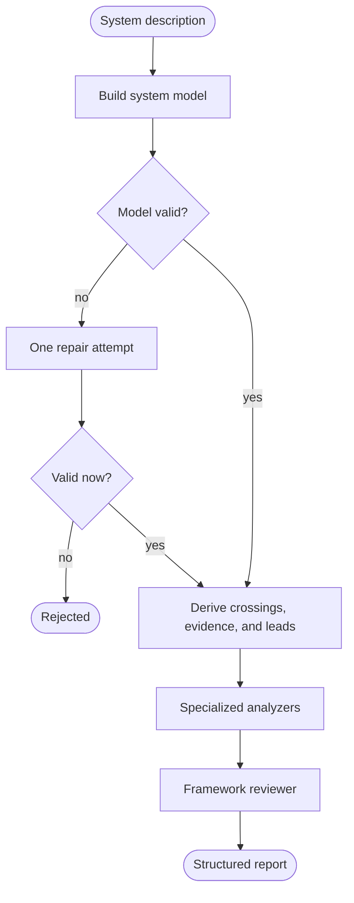

# Work Agent

**Early active development:** expect breaking changes.

Work Agent turns a written description of a software system into a structured
security analysis. It currently supports:

- **STRIDE threat modeling** — credible attacker actions, questions that need
  more information, and rejected draft findings.
- **OWASP ASVS 5.0.0 applicability analysis** — requirements that apply to the
  described system and questions the description cannot answer. This is not a
  compliance assessment and never reports that a requirement passed.

The output is JSON. It includes the system model used for the analysis, the
findings from each selected framework, the evidence behind each finding, and a
record of which model calls produced it.

## What actually happens

The implementation follows this path:

1. A model converts the submitted text into a data-flow model containing
   actors, processes, data stores, flows, and trust boundaries.
2. Code checks that model. It verifies its schema, IDs, references, trust-zone
   membership, controlled asset tags, and source excerpts. If it fails, a model
   gets one repair attempt; a second failure rejects the submission.
3. Code derives boundary crossings, an allowed evidence catalog, and
   framework-specific leads from the validated model. These leads tell an
   analyzer what to inspect; they are not findings and cannot become findings
   without a model making the security argument.
4. When a framework's precondition passes, one specialized analyzer runs for
   each of its lanes—six STRIDE categories or 17 ASVS chapters. The analyzers
   run in parallel and propose claims with evidence.
5. Code resolves those evidence references, verifies quoted text against the
   submitted sources, composes claim IDs, and removes individual proposals that
   cannot be represented safely. A claim based on an attribute the input left
   unknown is mechanically assigned `needs-info`.
6. Each framework's reviewer (called the **critic** in the code) judges the
   remaining drafts. It may confirm or reject them, remove duplicates, and—for
   STRIDE—correct severity. Code checks that every draft received one coherent
   ruling. A malformed review gets one retry; another failure fails the job.
7. Code builds one report containing the shared system model and one analysis
   block per selected framework.



The model makes security judgements. Code handles work that can be checked
mechanically. The distinction matters: a matched rule is a lead, not proof that
a vulnerability exists.

## What you get

A completed report contains:

- the extracted system model and code-derived boundary crossings;
- one block for every framework requested, in the requested order;
- actionable claims, rejected drafts, and items that need more information;
- grounds for every carried claim: source quotes, unknown or explicitly absent
  attributes, derived crossings, or an element the model does not contain;
- warnings for repaired quotes, unresolved references, dropped proposals, and
  other faults that cost an entry rather than the whole report;
- per-node timing, token use when the provider returns it, requested and served
  model identifiers, and sampling fingerprints.

Work Agent does **not** prove that a system is secure. The reports are generated
by models and are not human-reviewed. Sparse or inaccurate input produces a
sparse or inaccurate system model, which limits everything downstream.

## Try it

You need Python 3.11 or newer, [uv](https://docs.astral.sh/uv/), and credentials
for Vertex AI, Anthropic, or OpenAI.

```sh
git clone https://github.com/mstarks01/work-agent.git
cd work-agent
uv sync
```

No model is selected in the shipped configuration. Choose both the `base` model
(extraction and repair) and the `strong` model (framework analysis and review),
then set the credentials for their providers. The short, copyable setup for
each provider is in [First run](docs/First-Run.md).

Start the local demonstration app:

```sh
uv run python webapp/main.py
```

Open <http://127.0.0.1:8000>, load the included example, choose the frameworks,
and run the analysis. The app uses real models and stores its recent runs only
in memory. It is deliberately bound to loopback and has no authentication; do
not expose it to a network.

You can also embed [`Engine`](docs/Integration-Guide.md) directly or use the
authenticated asynchronous [`/v1` HTTP API](docs/HTTP-API.md). Both run the same
pipeline and return the same report shape.

## A few terms

- **System model** — the typed data-flow model extracted from the sources. It is
  the common input to every selected framework.
- **Lane** — one specialized part of a framework: a STRIDE category or ASVS
  chapter.
- **Candidate** — a lead produced by code from the system model. It directs an
  analyzer's attention but is neither evidence nor a finding.
- **Ground** — the evidence a claim rests on.
- **Critic** — the model that reviews one framework's proposed claims.
- **Fingerprint** — a hash of the served model route and resolved sampling
  settings for one model call. It identifies that generation setup; it does not
  prove the finding is correct or guarantee the same output on another run.
- **Certification** — a deployment-local comparison between observed sampling
  fingerprints and a list the operator approved. The report separately records
  an input digest and an instruction digest; certification does not combine or
  judge those values.

See [Concepts](docs/Concepts.md) for the full plain-language glossary.

## Documentation

- [First run](docs/First-Run.md) — install, select models, and produce a report.
- [Concepts](docs/Concepts.md) — understand the project without reading the
  implementation.
- [Integration guide](docs/Integration-Guide.md) — embed the engine and handle
  all outcomes.
- [Web app](docs/Web-App.md) — use the local demonstration UI.
- [Report schema](docs/Report-Schema.md) — consume the JSON report.
- [Configuration](docs/Configuration.md) — models, credentials, sampling,
  resilience, and input limits.
- [HTTP API](docs/HTTP-API.md) — run the service behind an authenticated API.
- [Architecture](docs/Architecture.md) — implementation details and extension
  points.
- [Contributing](CONTRIBUTING.md) — development and evaluation workflow.

## Development

The offline suite needs no provider credentials:

```sh
uv run pytest
uv run ruff check .
uv run mypy
uv run python evals/verify_corpus.py
uv run python examples/sync_docs.py --check
```

Two commands do call configured providers:

- `uv run python -m analysis_service.smoke` runs a small end-to-end analysis.
- `uv run python -m evals.harness.run run` evaluates the corpus.

The code is Apache-2.0. The ASVS catalog and the 17 ASVS lane skill files
reproduce OWASP ASVS 5.0.0 under CC BY-SA 4.0. [NOTICE](NOTICE) records the
exact scope of third-party material.
