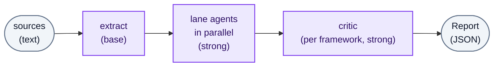

** This repo is under early active development and breaking changes should be expected. ** 

# stride-service

An agentic **STRIDE threat-modeling engine**: semi-structured text describing a
system goes in, a structured JSON threat report comes out. The analysis runs as
a [Google ADK](https://google.github.io/adk-docs/) multi-agent graph over
per-tier models from any supported vendor — Vertex, Anthropic or OpenAI, with no
privileged default.



**One extraction, many frameworks.** A single pass builds the canonical **System
Model** (a DFD), and every framework the job selected analyses that one model.
A framework ships as an in-repo **package** — its lanes, its deterministic
rules, its record type and its text — with STRIDE as the first one rather than
as the architecture. Its six lane agents draft threats in parallel, each citing
the grounds for every threat it raises, and each package's own critic reviews
its merged union in one pass — confirming, deduping, calibrating severity, and
rejecting what the model does not support. See [`CONTEXT.md`](CONTEXT.md) for
the domain glossary.

## Two ways to call it

- **In process** — embed `StrideEngine` and get a report back from a function
  call. The path for swapping the engine in behind an existing analysis
  interface.
- **Over HTTP** — the async [`/v1` job API](docs/HTTP-API.md), authenticated with
  a bearer token from any OIDC identity provider, for a decoupled front end.

Both surfaces drive the same pipeline and return the same
[`Report`](docs/Report-Schema.md): one envelope carrying the shared system
model, with one block per framework the job named.

**New here? [docs/First-Run.md](docs/First-Run.md)** takes you from a clone to a
real report to the engine embedded in your own code, in five steps.

**No vendor is selected out of the box.** `config/model_tiers.toml` ships with
both tiers empty, so choosing one is a required first step rather than an
override — "no privileged default" is a property of what ships, not just of the
mechanism. Reaching the models then needs credentials for whichever vendor each
tier names: Google Cloud application default credentials plus a project and
location for Vertex, or an API key for Anthropic or OpenAI. If either the
selection or its credentials are missing, startup stops with an error naming
what to set rather than running on some fallback nobody chose; see
[docs/Configuration.md](docs/Configuration.md). Offline tests and the in-memory
stub runner need none of it.

## Repository layout

| Path | What lives here |
|---|---|
| `src/stride_service/` | The shipped engine. Graph, agents, config loaders, report schema, HTTP API. |
| `config/` | Versioned config that stops startup rather than falling back: `model_tiers.toml`, `sampling.toml`, `resilience.toml`, `blessed-fingerprints.toml`. |
| `prompts/` | Agent prompts and per-category exemplars. |
| `skills/` | The per-category STRIDE skill Markdown baked into the image. |
| `docs/` | User-facing documentation (see below). |
| `examples/` | Runnable embedding examples and the shared sample source. The source of truth for every code block in the docs. |
| `webapp/` | The lite first-run web app. **Never ships** in the wheel; run from a clone. |
| `evals/` | Golden-case corpus, scorer, and the [eval harness](evals/README.md). **Never ships** in the image. |
| `tests/` | Offline test suite (no credentials required). |

The wheel bundles `config/`, `prompts/` and `skills/` alongside the engine
(under `stride_service/_bundled/`), so `pip install stride-service` elsewhere
resolves them with no extra step. This checkout's own `config/`, `prompts/`
and `skills/` stay the source of truth — edit them here, not the bundled copy,
which only exists inside a built wheel. The `STRIDE_*_DIR` variables still
redirect any of them, in either layout.

## Documentation

- **[First-Run](docs/First-Run.md)** — start here; clone to embedded engine in five steps.
- [Integration-Guide](docs/Integration-Guide.md) — embed the engine in process.
- [Web-App](docs/Web-App.md) — the lite local front end used on the first run.
- [Report-Schema](docs/Report-Schema.md) — the result shape, provenance, and the three outcomes.
- [Configuration](docs/Configuration.md) — config files, environment variables, and per-tier decoding.
- [HTTP-API](docs/HTTP-API.md) — the `/v1` async job contract, and its bearer auth.
- [Architecture](docs/Architecture.md) — the graph, the seams, and how a run is certified.


## Development

The project uses [uv](https://docs.astral.sh/uv/). Python ≥ 3.11.

```sh
uv sync                                    # install deps into .venv
uv run pytest                              # the offline suite — no credentials needed
uv run ruff check .                        # lint
uv run mypy                                # type check
uv run python evals/verify_corpus.py       # mechanical checks over the golden corpus
uv run python examples/sync_docs.py --check # the docs' code blocks match examples/
```

The tracked `pre-push` hook runs the two ruff checks and the type check CI runs.
Git does not enable hooks for a clone on its own, so opt in once:

```sh
git config core.hooksPath .githooks
```

It is a convenience guard rather than a gate — CI is authoritative, and
`git push --no-verify` skips it.

Everything under `tests/` and `evals/verify_corpus.py` is credential-free and
deterministic. The live commands need configured provider credentials:
`python -m stride_service.smoke` runs one small job through the shipped graph to
check that the vendor you selected actually serves it, and the eval harness
(`python -m evals.harness.run ...`) measures analysis quality over the golden
corpus — see [evals/TUNING.md](evals/TUNING.md).

## Status

The analysis code is complete and covered by an offline test suite. Three things
are worth stating separately, because they are different kinds of claim:

- **The blessed-fingerprint list ships empty, permanently and by design.**
  `config/blessed-fingerprints.toml` is *deployment-local*: certification attests
  that a report came from the exact model builds and sampling parameters your
  deployment blessed, so the project can never ship a certified pair on your
  behalf. An empty list is the correct shipped state, not missing work.
- **Per-tier sampling is an open tuning loop.** The shipped decoding default is
  `temperature = 0`. Improving the per-tier values is a measured process against
  the golden corpus — see [evals/TUNING.md](evals/TUNING.md).
- **No provider has served a request in CI.** Two kinds of live lane exist and
  neither has run: the per-vendor [provider smoke](docs/Configuration.md#checking-that-a-provider-actually-serves-the-graph),
  which asks whether a vendor serves this graph at all, and the golden-corpus
  eval sweeps, which ask how good its threat models are. Both need credentials
  this repository does not hold, and each says so in its own job summary rather
  than passing quietly. This is a not-yet rather than a cannot.

Persistent job and session backends are left as seams — the in-memory defaults
are enough to get a report in process.
