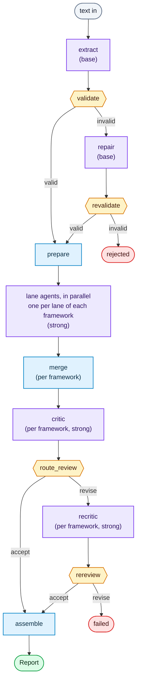

# Architecture

Both entry points — the in-process [engine](Integration-Guide.md) and the
[`/v1` API](HTTP-API.md) — drive one Google ADK Workflow graph and shape its
outcome into a [`Report`](Report-Schema.md). This page is the map of what
runs between text in and report out. Read [Concepts](Concepts.md) first if terms
such as system model, lane, ground, or critic are unfamiliar.

The central split is simple: models extract facts and make security judgements;
code performs checks with definite answers. The code does not make the whole
analysis deterministic. It validates and constrains the probabilistic stages.

## The pipeline

A static ADK Workflow with deterministic `FunctionNode` bookends around the
model calls:

Purple nodes are model calls. Everything else is a deterministic `FunctionNode`:
blue ones do work, amber ones only choose an edge, and the rounded ends are the
run's three outcomes.

- **extract** turns the untrusted text into a canonical system model (five DFD
  element types: external entity, process, data store, data flow, trust
  boundary).
- **validate** is a mechanical gate. Failures route to **repair** (one bounded
  pass over the original text) and revalidate; a model that still fails, or is
  over the [150-element cap](Configuration.md), ends as a **rejection**.
- **prepare** derives the per-analysis context, all of it a pure function of the
  validated model: the boundary crossings; the **deterministic candidates** for
  each lane; the **domain packs** this system earns; and the system model as the
  agents will see it — with `source_excerpt`, `source_label` and
  `source_speaker` stripped, so the only submitter words downstream of here are
  the ones a finding chose to quote.
- **lane agents** (`analyze_<framework>_<lane>`) run in parallel — one per lane
  of each framework the job selected, which for STRIDE is its six categories.
  Each drafts claims in its own lane, and each claim cites at least one
  **ground**: a quote from the submitted text, an `unknown` attribute, or a
  boundary crossing. A **candidate is never one of those** — it is a structural
  lead code found, which an agent may investigate and reject, and which nothing
  downstream of the prompt reads.
- **merge** joins one framework's drafts and runs the mechanical half of the
  fan-in: every reference resolves, no two lanes reused a claim ID, and every
  quote ground is matched against the bytes of the source it names. A refused
  quote is rewritten to the source's own nearest span where one is near enough
  ([`repaired_quotes`](Report-Schema.md#repaired_quotes--quotes-rewritten-to-the-sources-own-span)).
  An unverifiable quote is marked and still renders; a claim where *nothing*
  verifies is dropped and marked as a
  [`dropped_claims`](Report-Schema.md#dropped_claims--claims-the-service-dropped-for-a-fault-in-one-entry)
  entry. It also computes the per-lane
  [`coverage`](Report-Schema.md#coverage--what-each-lane-was-offered) account
  over the drafts.
  Then that framework's **critic** rules on all of them in one pass — verdicts,
  dedupe, severity calibration — spending judgement only on what code cannot
  check. **Each package carries its own critic, blind to every other
  framework**: two frameworks' subgraphs never touch between `prepare` and
  `assemble`, because a critic rules its own framework's claims against its own
  framework's question.
- **route_review** runs the mechanical checks the assembler depends on. If the
  critic's output fails them, one bounded **recritic** re-ask runs; a second
  failure is a `failed` job, not a rejection.
- **assemble** builds the final report.

Untrusted input is placed in fenced prompt sections that tell the model to treat
it as data. This is an instruction-level defense, not a proof that prompt
injection is impossible. Every model output is validated before code relies on
it.

## Models

Every LLM node runs on one of two **model tiers** — named for the job they do,
not for any vendor's product line:

- **`base`** — the workhorse: `extract` and `repair`.
- **`strong`** — judgement: every framework's lane agents, its `critic`, and the
  `recritic`.

[`config/model_tiers.toml`](Configuration.md) maps nodes to tiers and each tier
to a `(vendor, model)` pair. Deterministic `FunctionNode`s carry no model. The
`strong` tier does most of a job's model work — the six-way category fan-out
plus the critic and its re-ask.

The tiers choose their vendor **independently**, so they can run different
vendors at the same time. A third tier, `review`, exists so criticism can be
bound off the model it checks; the shipped node map points nothing at it. Every
vendor is reached through one adapter (LiteLLM), and the LLM nodes share **one
adapter per bound tier** — so the startup checks on credentials and decoding
parameters run once per tier rather than once per node, and a selected tier
nothing runs on costs no credential at all.

## Provenance and certification

The implementation records three related values:

- **Served build** — the model identifier the provider says actually answered a
  request, prefixed with its vendor (`vertex_ai/gemini-2.5-pro-002`). Not
  necessarily the one you asked for. Gemini is the worked example here because
  one had to be. It is also the one profiled family whose served build differs
  from the route you asked for, which is the distinction these three terms
  exist to draw. On Claude, both model fields hold the same string.
- **Sampling fingerprint** — `sha256` of the provider-qualified served model
  plus that tier's resolved decoding parameters. It identifies the generation
  setup, not everything that affected the output: the report records the input
  digest and instruction digest separately.
- **Blessed** — a fingerprint recorded in `config/blessed-fingerprints.toml`
  because a measured, sanctioned run produced it. The list is this deployment's
  own; nothing about it ships from this repo.

Every completed report carries enough information to compare model selection,
sampling, input identity, and instruction identity. It does not make a
probabilistic result reproducible in the strict sense.

| Field | What it holds |
| --- | --- |
| `NodeRun.requested_model` | The configured route — what was asked for (`vertex_ai/gemini-2.5-pro`). |
| `NodeRun.model` | The served build — what actually answered (`vertex_ai/gemini-2.5-pro-002`). |
| `NodeRun.instruction_sha256` | The digest of the instructions the graph this node ran in carried. |
| `NodeRun.execution_fingerprint` | The identity hash: both routes, the tier's decoding params, the instruction digest, and the build versions. |
| `Report.execution` | The identity schema version, how far the served builds can be trusted, and those build versions. |

The report records both model fields and compares neither directly. A served
model change changes the execution fingerprint, which makes the run uncertified
unless the deployment has blessed that fingerprint.

**The identity binds the requested route as well as the served one.** The served
build is what the provider *said* answered, read off its own event stream, and
nothing verifies it — `Report.execution.served_model_trust` says so in the
artifact rather than leaving a reader to assume better. Binding both routes is
what stops the provider's word from selecting a blessed entry on its own: a
translator that returns an approved build while the deployment asked for
something cheaper presents a pair no manifest holds.

**A prompt edit, a `litellm` bump or a service release moves every fingerprint.**
Each of those changes what a node can answer, so each re-baselines the manifest
and runs read as uncertified until a sanctioned sweep blesses the new hashes.

The fingerprint is computed **per node execution**, not once at startup. If the
served model changes during a run, different nodes can therefore carry different
fingerprints. The vendor prefix is part of the hash because a served identifier
alone carries no vendor—Vertex-hosted Claude and Anthropic-direct Claude can
return the same model string.

`config/blessed-fingerprints.toml` records blessed fingerprints **per tier**,
not per node. A fingerprint contains no node name, and `critic` and `recritic`
run on the same tier, so they present a byte-identical hash; keying by node
would call that one hash blessed under `critic` and unblessed under `recritic`,
marking the first revise path in production uncertified on a technicality.

The list is **deployment-local**. This project can never ship a run that already
counts as certified, because a repo-level blessing plus a local one could only
resolve as one silently overriding the other.
`ANALYSIS_BLESSED_FINGERPRINTS` chooses *which* single file is read — it does not
layer a second one on top.

The service checks every completed job against the deployment's fingerprint
manifest. This is a narrow operational attestation: it says whether the observed
model-and-sampling fingerprints were approved. It does not judge the extracted
model, findings, prompts, or input.

| State | Meaning | Effect on `GET /v1/jobs/{id}/report` |
| --- | --- | --- |
| certified | Every observed fingerprint is blessed | Served |
| uncertified | At least one is not | Served **unless** `ANALYSIS_REQUIRE_CERTIFIED` |
| unexercised | A tier the graph declares presented no fingerprint at all | **Always** withheld |

The lists ship **empty**, so until you promote a measured baseline every run
reads as uncertified. That is recorded, not fatal — a gate that fires before
anyone knows the normal range just trains people to switch it off. Promoting one
is `python -m evals.harness.run promote <artifact> --yes`, which derives the
blessed fingerprints from the served builds the sweep observed rather than from
anything typed in by hand — see
[TUNING.md](../evals/TUNING.md#step-5--promote-the-winner).
`unexercised` is different: every tier has a node that always runs, so it cannot
happen on a run that produced a report at all. It is an internal assertion, and
enforcing it costs nothing.

Withholding refuses the *report*; it never fails the job. A failed job carries no
report at all, and the fingerprints that show what drifted live inside it.
Nothing about certification appears in the job status view — it is operator-only.

| Variable | Effect |
| --- | --- |
| `ANALYSIS_REQUIRE_CERTIFIED` | Withhold the report when the run is uncertified. Off by default. |

## Outcomes

The graph reaches one of three states, surfaced identically by both entry
points:

- **completed** — a `Report`.
- **rejected** — the input failed the validity gate; carries the
  `ValidationIssue`s.
- **failed** (raises) — an internal error. No partial report is ever produced:
  an empty Tampering section means "looked, found nothing", never "the Tampering
  agent errored".

That last guarantee is enforced, not assumed. An LLM node whose completion is
truncated writes no output key at all — ADK saves one only from a final event
carrying text — so "the agent errored" and "the agent found nothing" arrive
as an *absent* key and an *empty* one. `merge_drafts` distinguishes them and
fails the job on the first, naming the lanes and the knob; `validate_extraction`
does the same one node earlier. Read as equivalent, a truncated agent would
delete a sixth of the analysis and finish green, because the critic rules what
it is handed and `by_category` omits a lane with no threats rather than
carrying a zero.

## Resilience

Retry, timeout and the per-job deadline are configured in [`config/resilience.toml`](Configuration.md)
and attached to the adapter itself, so a retry is invisible to the graph and the
report's `nodes` array is unchanged by one. A per-request timeout turns a hang
into an error the retry can act on. Three attempts by default.

## Concurrency and isolation

Concurrent analyses are independent. Each `analyze()` call runs one job in its
own ADK session, created fresh with a unique session id and seeded with only that
job's own input text; the graph's per-run data lives entirely in that session's
state, read back by the same session id. The engine, runner, and compiled
pipeline hold no per-run state — they carry only read-only configuration (the
node→model map, the loaded prompts and skills), so one engine is safe to share
across every call.

- **Isolation is per session, not per caller.** Two analyses submitted at the
  same time by the same caller still get separate sessions, so they can never
  read or overwrite each other's state.
- **Within a single analysis**, the lane agents run in parallel but each writes
  to its own category-keyed slot in the session, so the parallel branches don't
  clobber one another before the merge.
- **Untrusted input stays contained.** Because a job's text lives only in its own
  session (as fenced data — see [The pipeline](#the-pipeline)), a prompt-injection
  attempt in one submission cannot reach another running analysis.

**Containment is not resistance, and the two are measured differently.** Fencing
is structural and deterministic: every caller byte sits inside a marker sized to
its own content, so a submission cannot close the block it is in and continue in
instruction position. `evals/adversarial/` carries a source built to try exactly
that, and CI asserts it fails.

What fencing does *not* do is stop a model reading `ignore all previous
instructions` from inside a fence and deciding to obey it. That is semantic, it
is a property of a model and a prompt set rather than of this code, and it is
measured by scoring a report against what the injection asked for — deterministic
grading, no model judge. That half needs a live model and has never run; see
`evals/adversarial/README.md` for the bar and the residual risk.

The consequence of a failure is bounded by what a model here can reach: **no
model in this service holds any tool or host authority.** Every LLM node returns
structured text that a deterministic `FunctionNode` validates, so a model talked
into something is talked into producing a bad report, not into acting.

This guarantee assumes the intended concurrency model: `async` calls on a single
event loop. The default `InMemorySessionService` is an in-process store — safe
for cooperative async concurrency with distinct session ids, but not a
thread-safe store to share across OS threads. Scaling across processes keeps
analyses isolated (nothing is shared), but then each worker has its own in-memory
job and session state, so a job must be routed to the worker that holds it —
which is what the persistent backends below are for.

## The model translator runs in this process

Every model reaches its provider through ADK's `LiteLlm` and, beneath that,
`litellm` — [ADR 0015](adr/0015-adk-and-litellm-are-one-substrate.md) records
why that is one substrate rather than a swappable adapter. Both run **in the
service process, with the service's authority**. LiteLLM holds the provider
credentials, opens the network connections, and is the only code between a
node's request and a provider's answer.

**State the consequence plainly: a compromise of that dependency is a compromise
of this application.** A malicious release, or arbitrary code execution inside
it, would reach the process's environment — including every provider credential
this deployment declared — its filesystem, and its outbound network. Nothing in
this repository contains that, because containment is deployment work and this
repository ships no deployment packaging: no image, no container definition, no
egress policy. An operator running this service in production owns that
boundary. What it should look like is set out in
[#502](https://github.com/mstarks01/work-agent/issues/502).

What the repository *does* bound is the seam — the set of values this service
hands the translator, and where each comes from:

| What crosses | Where it comes from |
| --- | --- |
| the model route | `Vendor.route()` — a registry entry, in code |
| the credential kwargs | the vendor's own table, read from declared `ANALYSIS_*` variables |
| the decoding params | `sampling.toml` plus an explicit env allowlist |
| `num_retries=0` | a literal |

**No provider endpoint crosses it at all.** Nothing sets `api_base`, `base_url`
or `api_version` anywhere in the package, so a request goes where the vendor's
own client sends it. `custom_llm_provider` is set — the build-time capability
probe has to name a provider — and only ever from a `Vendor`.

That matters because prompts, submitted sources, corpus text and model output
all flow through this process. An adapter that accepted an address from any of
them would be an SSRF and endpoint-substitution path.
`tests/test_translator_seam.py` fails if one appears, if a decoding param could
express one, or if a new value starts crossing the seam.

Dependency versions are pinned exactly (`pyproject.toml`) and hashed at install
(`uv.lock`), and the installed version of every distribution between a node and
its provider is inside each run's
[execution identity](#provenance-and-certification) — so a `litellm` bump moves
every fingerprint rather than silently reusing a blessing taken before it.

## Seams

The pipeline is reached through interfaces, so backends are swappable and the
whole graph runs offline against scripted models:

| Seam | Interface | Default | Status |
| --- | --- | --- | --- |
| Pipeline execution | `PipelineRunner` | `AdkPipelineRunner` (real graph) / `StubPipelineRunner` (tests) | Complete |
| Job persistence | `JobStore` | `InMemoryJobStore` (`memory`) | Backend selected by `ANALYSIS_JOB_STORE` via a fail-closed registry; only the non-durable `memory` backend ships — a durable one is a new registry entry |
| ADK sessions | `BaseSessionService` | `InMemorySessionService` | In-memory only; a `session_service_uri` backend is unwired |

The in-memory defaults are enough to get a report in process. Choosing a backend
is already wired for the `JobStore` (`ANALYSIS_JOB_STORE`, which stops startup on
an unset or unknown value rather than quietly falling back). Still out of scope
for the current work: a durable `JobStore` implementation, a session backend,
deployment packaging (container, Cloud Run), and observability. The interfaces
and the selection seam are in place for all of them.

## Where the code lives

| Module | Responsibility |
| --- | --- |
| `analysis_service.engine` | In-process `Engine` facade. |
| `analysis_service.api` | The `/v1` FastAPI app. |
| `analysis_service.jobs` | Job lifecycle, `JobStore`, `PipelineRunner` seams. |
| `analysis_service.sources` | `Source`: the untrusted text a job is built from, the per-deployment bounds both entry points enforce, and the fenced render that is the only way caller bytes reach a model (OWASP LLM01). |
| `analysis_service.deployment` | One installation's config, resolved once: the files, the graph they configure, its runner and its certification gate. |
| `analysis_service.pipeline` | `AdkPipelineRunner`: one job's identity, input digest and certification around a Graph Run. |
| `analysis_service.execution` | Drives a built graph and stamps each node execution. Shared by the service and the eval harness. |
| `analysis_service.graph` | Topology and node functions. |
| `analysis_service.system_model` | Canonical model + validity helpers. |
| `analysis_service.analysis` | Deterministic traversal of a validated model: flows, reachability, paths, unknown controls. No security claims. |
| `analysis_service.candidates` | The rule table. Structural conditions an agent should investigate — leads, never findings, never evidence. |
| `analysis_service.domains` | Which `skills/domains/` packs a model earns, decided from its own technology fields. |
| `analysis_service.coverage` | Per-lane accounting: what each agent was offered, and what its drafts cite. |
| `analysis_service.report` | The `Report` envelope, the neutral `Claim` and the severity model. |
| `analysis_service.frameworks` | The framework-package contract, its registry and its deployment gate. |
| `analysis_service.validation` | The mechanical validity gate. |
| `analysis_service.critic` | The mechanical checks around the critic step — the ones no model should be asked to perform. |
| `analysis_service.skills` / `.prompts` / `.markdown_loader` | Skill/prompt loading and composition. |
| `analysis_service.model_tiers` / `.sampling` / `.resilience` | Config loaders. |
| `analysis_service.vendors` | The vendor registry: each vendor's router prefix, credential mode, and model-name rules. |
| `analysis_service.binding` | Builds one adapter per tier from `(vendor, model, sampling, resilience)`, and the `NodeBinding` the graph binds onto its LLM nodes. |
| `analysis_service.model_gate` | The startup check that asks the provider library whether a tier's parameters are actually supported. |
| `analysis_service.certification` | Compares a run's fingerprints against the deployment's blessed manifest. |
| `analysis_service.auth` | Bearer-token (OIDC JWT) verification. |
| `analysis_service.errors` | `ConfigError`, the base every fail-closed config loader raises — so a caller can handle "this deployment cannot run" without enumerating which knob was wrong. |
