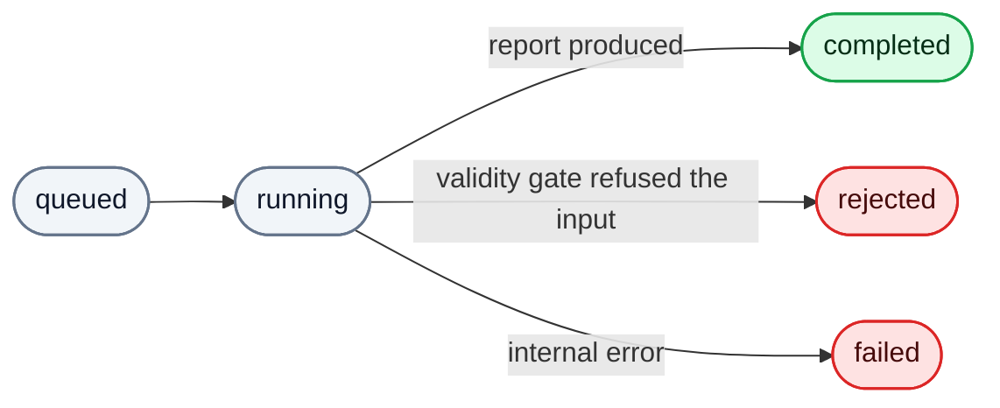

# HTTP API

The `/v1` job API is the decoupled surface for a front end. It is async:
submit text, get a job handle, poll or stream until the report is ready. For an
in-process integration prefer [`StrideEngine`](Integration-Guide.md) — it drives
the same pipeline without the job/auth/polling machinery.

Build the app with `create_app()`; every seam is injectable, defaulting to
production wiring.

```python
from stride_service import create_app

app = create_app()  # configured store, real pipeline, configured JWT verifier
```

See [Configuration](Configuration.md) for the required
[`STRIDE_AUTH_PROVIDER` / `STRIDE_OIDC_*`](#bearer-auth),
the [`STRIDE_JOB_STORE`](#job-storage) backend
selection, and the
[credentials](Configuration.md#provider-environment) for whichever model vendor
each tier uses.

## Auth

Every `/v1` route requires a bearer JWT (RS256, verified against the configured
issuer, audience, and JWKS) from the selected auth provider — see
[Bearer auth](#bearer-auth) below for supported identity providers and setup.
Job reads are **owner-only**: a request from
anyone but the job's owner gets `404`, not `403`, so job IDs cannot be probed
for existence. Rejection detail is generic on purpose — the real reason is
logged, never returned.

## Routes

| Method | Path | Purpose |
| --- | --- | --- |
| `POST` | `/v1/jobs` | Submit an ordered list of sources; returns a job handle. `429` when this token is already at its [concurrency ceiling](#how-many-jobs-you-may-run-at-once). |
| `GET` | `/v1/jobs/{id}` | Poll: status, per-node progress, timestamps. Never the report. |
| `GET` | `/v1/jobs/{id}/events` | The same progression as Server-Sent Events; resumable via `Last-Event-ID`. |
| `GET` | `/v1/jobs/{id}/report` | The full [report](Report-Schema.md) once completed; `409` before, and `409` if the report is withheld (below). |
| `GET` | `/healthz` | Unauthenticated liveness probe. |

Errors are RFC 9457 `application/problem+json`.

### When the report is withheld

A completed job's report can still be refused. Before serving it, the service
checks the run's **fingerprints** — a per-node hash of the model build that
answered plus that tier's decoding parameters — against the list this deployment
has **blessed** (approved by a measured run, in
`config/blessed-fingerprints.toml`). Two cases refuse with `409`:

- the run is **uncertified** (a fingerprint isn't blessed) *and*
  `STRIDE_REQUIRE_CERTIFIED` is set — off by default;
- the run is **unexercised** (a tier the graph declares produced no fingerprint
  at all) — always refused, and not reachable on a run that produced a report.

The problem body names the unblessed nodes and their hashes, and the tiers that
went unexercised. It never includes the analysis. The job itself stays
`completed` — withholding refuses the delivery, not the work, because the
fingerprints that show what drifted live inside the report. Nothing about this
appears in `GET /v1/jobs/{id}`; it is operator-facing only. See
[Architecture](Architecture.md#provenance-and-certification).

## Lifecycle



- `completed` — the report is available at `/v1/jobs/{id}/report`.
- `rejected` — the input failed the validity gate; the poll response carries the
  `validation_issues` (see [Report-Schema](Report-Schema.md)).
- `failed` — an internal error; only a generic message is exposed.

This mirrors the engine's three outcomes; the HTTP layer adds the queue,
ownership, and delivery around them.

## Submit and poll

```http
POST /v1/jobs
Authorization: Bearer <jwt>
Content-Type: application/json

{
  "sources": [
    {"kind": "description", "label": "Architecture note",
     "text": "Customers sign in and place orders..."},
    {"kind": "transcript", "label": "Kickoff call, 14 May",
     "text": "Ana: the orders DB is Postgres. Bob: I think it's 13."}
  ],
  "frameworks": [{"name": "stride"}],
  "system_name": "Orders"
}
```

`frameworks` is **required and non-empty**, and names which security frameworks
this job is analysed under. There is no default: a contract that picked one for
you would mean two different things on two deployments, and a job that silently
analysed fewer frameworks than it asked for is worse than one that refused. Each
entry is `{name, options}`, where `options` defaults to `{}` on the envelope and
the named package's own model decides what it needs — so a framework requiring a
job-level value rejects a submission that omits it, naming the field. Which
names a deployment carries is its `config/frameworks.toml`; an unknown one is
refused on the input ladder, before a job record exists and before anything is
billed.

The report answers exactly this set, one block per framework, in this order.

Each source is `{kind, label, text}`. `kind` is `description` or `transcript`
and selects the guidance extraction reads the text under. `label` is yours: it
must be unique within the job, at most 200 characters and single-line, and it
is the key every `source_excerpt` in the report cites, so pick something you
will recognise. Order is presentation only — **sources carry equal weight**, and
an earlier one does not override a later one. A single-source job is a
one-element list.

The service takes **text only**. Decode `.vtt`, `.docx` or a meeting-tool export
to text before submitting; there is no multipart upload and no file parsing.

```json
201 Created
Location: /v1/jobs/job-ab12...
{"job_id": "job-ab12...", "status": "queued"}
```

Then `GET /v1/jobs/job-ab12...` until `status` is terminal, or subscribe to
`GET /v1/jobs/job-ab12.../events`.

### What a submission is rejected for

Bounds are this deployment's (see [Configuration](Configuration.md)); the
shipped values are 100 KiB total across all sources and 10 sources. They are
counted in **UTF-8 bytes**, not tokens, so what you may submit does not change
when a deployment changes vendor. Shape is checked before size:

| Status | Cause |
| --- | --- |
| `422` | A source is malformed: unknown `kind`, missing or over-long `label`, empty `text`, an unknown field. |
| `422` | A `label` carries a control, bidi or zero-width character. A label is a citation key rendered as chrome beside the text it names, so a character that renders as something other than what it is can misrepresent the report. Rejected rather than stripped: a label is bounded but never rewritten, so repairing one would cite something you did not submit. Line breaks are refused for the same reason. |
| `400` | `sources` is present but empty. |
| `422` | `frameworks` is missing or empty. There is no default, so an omitted selection is a malformed submission rather than an implied one. |
| `422` | `frameworks` names a framework this deployment does not carry, or names one twice. The message names it; order carries nothing, so a repeat is a mistake rather than a preference. |
| `422` | Two sources share a `label`. Refused at any size — a label is a citation key, so a repeated one leaves every excerpt naming it ambiguous. The message names the repeated labels. |
| `413` | More sources than the deployment allows. The message names the count and the limit. |
| `413` | The sources total more bytes than allowed. There is no per-source cap, so the message names **no** culprit — it carries a per-label byte breakdown instead, because the overspend belongs to the sum. |

An absurdly large body is refused before it is parsed at all, by a coarse guard
derived from the byte budget.

### How many jobs you may run at once

Every rejection above is about the submission. One is about **you**: a token may
hold only `max_active_jobs` jobs in flight — `queued` plus `running` — and the
shipped value is 3.

| Status | Cause |
| --- | --- |
| `429` | This token is already at its ceiling. The message names your current count and the limit. |

This one is checked **before** the table above, so a caller at their ceiling
gets `429` whatever they sent — it is a fact about the caller, not the payload,
and checking it second would make the ceiling probe-able through requests that
were never going to run.

A submission past the ceiling is **refused, not queued**. Each accepted job fans
every selected framework's lane agents out in parallel on the strongest model
tier, so a queued job
holds your place in the deployment's provider quota just as a running one does;
only a refusal sheds the load. No `Retry-After` is sent, because what clears the
ceiling is a job of yours reaching a terminal state rather than the passage of
time — poll or subscribe to the jobs you have, then resubmit. The count is not
a rate: nothing accrues over a window, and finishing a job immediately buys the
next one. See [ADR 0007](adr/0007-per-caller-concurrency-ceiling.md).

**Because the count is not a rate, this service does not bound a caller's spend
over time — you must.** One token that submits serially, letting each job finish
before the next, stays under the ceiling while running an unbounded number of
paid jobs. Place a per-caller rate limit (requests or cost per window) at your
edge or gateway in front of `/v1`; the concurrency ceiling is the backstop
behind it, not a substitute for it. This is the unbounded-consumption half of
OWASP LLM10, and it is the integrator's to close.

## Bearer auth

These apply to the `/v1` API only; the in-process engine uses none of them.
Every `/v1` route requires a valid bearer token; the verifier returns the
token's `sub`, and job ownership binds to that subject.

### How the provider is chosen

`STRIDE_AUTH_PROVIDER` selects the backend at deploy time and **fails closed** —
an unset or unknown value stops startup rather than weakening or skipping the
check. The value is never read from the request, so a token can't pick its own
verifier.

| Variable | Purpose |
| --- | --- |
| `STRIDE_AUTH_PROVIDER` | Auth backend to use. Today: `oidc`. |

Each backend reads its own prefixed settings. The `oidc` backend is a standard
**OIDC JWT verifier**, configured through `STRIDE_OIDC_*`:

| Variable | Purpose |
| --- | --- |
| `STRIDE_OIDC_ISSUER` | Expected `iss` claim — your IdP's issuer URL. |
| `STRIDE_OIDC_AUDIENCE` | Expected `aud` claim — the API's identifier at the IdP. |
| `STRIDE_OIDC_JWKS_URL` | JWKS endpoint the IdP publishes its signing keys at. |
| `STRIDE_OIDC_ALGORITHMS` | *Optional.* Comma-separated accepted signing algorithms. Defaults to `RS256`. |

Tokens must carry `exp`, `iss`, `aud`, and `sub`, and be signed with one of the
accepted algorithms; anything else is rejected with a single generic error (the
real reason is logged, never returned).

#### Signing algorithms

`RS256` is the default because it is OIDC Core's mandatory-to-implement
algorithm, so a deployment that sets nothing works against any compliant IdP. An
IdP signing something else — `ES256` is common — is configured, not code-changed:

```bash
export STRIDE_OIDC_ALGORITHMS="ES256"        # or "RS256,ES256" during a rotation
```

The accepted set is an **allowlist**, and configuration chooses from it rather
than extending it: `RS256/384/512`, `PS256/384/512`, `ES256/384/512`, `EdDSA`.

Two things it will not accept, and the refusal is deliberate:

- **`none`** — the unsigned-JWT algorithm. Accepting it makes every token
  forgeable.
- **`HS*`** — HMAC. Keys here arrive from a JWKS endpoint and are *public*, so
  accepting a symmetric algorithm alongside asymmetric ones is the classic
  key-confusion attack: an attacker re-signs a token they wrote using the public
  key as the HMAC secret, and verification passes because the verifier treated a
  verification key as a signing key.

The list is also never read from the IdP's discovery document. Letting the party
being verified declare how it is verified inverts the trust relationship the
check exists to establish. A rejected algorithm fails at startup, naming what it
rejected — not at the first request.

### Supported identity providers

The `oidc` backend speaks plain OIDC, so it works with **any OIDC-compliant
identity provider**. Nothing in the implementation knows the name of one: the
configuration surface is issuer, audience, JWKS endpoint and signing algorithms,
which is OIDC's own vocabulary. For each provider, the settings come from its
discovery document (`<issuer>/.well-known/openid-configuration` → `issuer`,
`jwks_uri` and `id_token_signing_alg_values_supported`); the audience is the
API/resource identifier you register for this service. Switching providers is a
values change only — the variable names stay `STRIDE_OIDC_*`.

Listed alphabetically. None is more supported than any other, and the list is
illustrative rather than exhaustive — an IdP absent from it is not unsupported.

| Provider | Typical issuer (`STRIDE_OIDC_ISSUER`) |
| --- | --- |
| Auth0 | `https://<tenant>.auth0.com/` |
| AWS Cognito | `https://cognito-idp.<region>.amazonaws.com/<pool-id>` |
| Keycloak | `https://<host>/realms/<realm>` |
| Microsoft Entra ID (Azure AD) | `https://login.microsoftonline.com/<tenant-id>/v2.0` |
| Okta | `https://<org>.okta.com/oauth2/<auth-server-id>` |
| Ping (PingOne / PingFederate) | `https://auth.pingone.com/<env-id>/as` |

### Example: Okta

1. In the IdP, register this service as an API/resource and note the **audience**
   (resource identifier) clients will request tokens for — e.g. `stride-service`.
2. Fetch the discovery document to read the issuer and JWKS URL:
   ```bash
   curl -s https://<org>.okta.com/oauth2/<auth-server-id>/.well-known/openid-configuration \
     | jq '{issuer, jwks_uri}'
   ```
3. Set the environment:
   ```bash
   export STRIDE_AUTH_PROVIDER=oidc
   export STRIDE_OIDC_ISSUER="https://<org>.okta.com/oauth2/<auth-server-id>"
   export STRIDE_OIDC_AUDIENCE="stride-service"
   export STRIDE_OIDC_JWKS_URL="https://<org>.okta.com/oauth2/<auth-server-id>/v1/keys"
   ```
4. Start the app. Callers pass `Authorization: Bearer <token>` on every `/v1`
   request; see the [HTTP API](HTTP-API.md) for the routes.

Okta is the worked example because one had to be, not because it is preferred.
Pointing at a different OIDC IdP (Auth0, Entra, Ping, …) is the same settings
read from that IdP's discovery document — no code change, and a different
signing algorithm is `STRIDE_OIDC_ALGORITHMS` rather than a patch.

### Adding a new backend

A backend with a distinct name (or a non-OIDC mechanism — opaque-token
introspection, mTLS, an API key) is a new entry in the `_FACTORIES` registry in
[`src/stride_service/auth.py`](../src/stride_service/auth.py). Reuse
`OidcJwtVerifier` for another OIDC issuer, or implement the `TokenVerifier`
protocol (`verify(token) -> str`) for anything else; the API layer is unchanged.

## Job storage

Required by the [`/v1` API](HTTP-API.md); the in-process engine keeps no jobs.
The API only ever talks to the `JobStore` interface, so the backend is a
deploy-time choice.

`STRIDE_JOB_STORE` selects the backend at startup and **fails closed** — an
unset or unknown value stops startup rather than silently falling back to
non-durable storage. The value is never read from the request.

| Variable | Purpose |
| --- | --- |
| `STRIDE_JOB_STORE` | Job-store backend to use. Today: `memory`. |

The `memory` backend is a per-instance, in-process dict: fast and dependency-free,
but jobs are lost on restart and are not shared across instances, so it suits
single-instance or development deployments only. Durable, multi-instance
deployments need a shared backend (see below).

### Adding a new backend

A durable or shared backend (Redis, Postgres, …) is a new entry in the
`_FACTORIES` registry in [`src/stride_service/jobs.py`](../src/stride_service/jobs.py).
Implement the `JobStore` protocol (`create`, `get`, `save`) and read any
connection settings from its own prefixed env vars; the API layer is unchanged.
