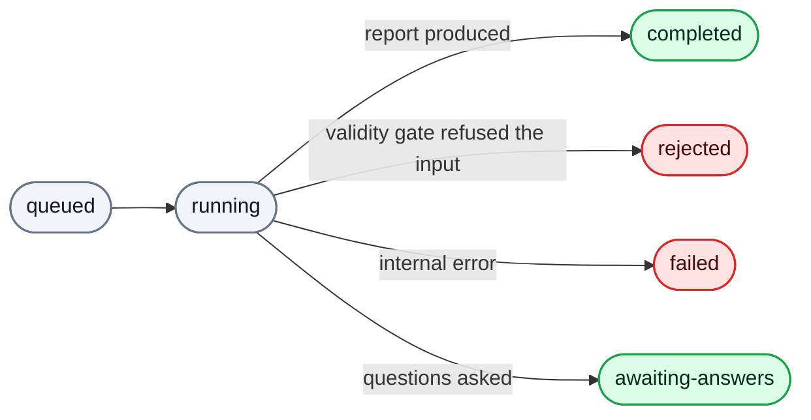

# HTTP API

The `/v1` job API is the decoupled surface for a front end. It is async:
submit text, get a job handle, poll or stream until the report is ready. For an
in-process integration prefer [`Engine`](Integration-Guide.md) — it drives
the same pipeline without the job/auth/polling machinery.

Build the app with `create_app()`; every seam is injectable, defaulting to
production wiring.

```python
from analysis_service import create_app

app = create_app()  # configured store, real pipeline, configured JWT verifier
```

See [Configuration](Configuration.md) for the required
[`ANALYSIS_AUTH_PROVIDER` / `ANALYSIS_OIDC_*`](#bearer-auth),
the [`ANALYSIS_JOB_STORE`](#job-storage) backend
selection, and the
[credentials](Configuration.md#provider-environment) for whichever model vendor
each tier uses.

## Auth

Every `/v1` route requires a bearer JWT (RS256, verified against the configured
issuer, audience, and JWKS) from the selected auth provider — see
[Bearer auth](#bearer-auth) below for supported identity providers and setup.
Job reads are **owner-only**: a request from
anyone but the job's owner gets `404`, not `403`, so job IDs cannot be probed
for existence. Rejection detail is generic on purpose — the real reason is
logged, never returned.

## Routes

| Method | Path | Purpose |
| --- | --- | --- |
| `POST` | `/v1/jobs` | Submit an ordered list of sources; returns a job handle. `429` when this token is already at its [concurrency ceiling](#how-many-jobs-you-may-run-at-once). |
| `GET` | `/v1/jobs/{id}` | Poll: status, per-node progress, timestamps. Never the report. |
| `GET` | `/v1/jobs/{id}/events` | The same progression as Server-Sent Events; resumable via `Last-Event-ID`. |
| `GET` | `/v1/jobs/{id}/report` | The full [report](Report-Schema.md) once completed; `409` before, and `409` if the report is withheld (below). |
| `POST` | `/v1/jobs/{id}/corrections` | Correct a final report's answers, as `{"facts": [...]}`: a changed value, or `unknown`. `200` with `{"job_id", "corrections", "corrected_findings"}`. No job starts, and the report is not rewritten. `400` where the report is not final, a correction names no answer the report read, or changes none. |
| `POST` | `/v1/jobs/{id}/answers` | Answer the questions of a completed job or a job in `awaiting-answers`. Starts a **new** job that resumes from this one's model and catalog; `201` with its `job_id`. With `"save": true`, a waiting job keeps the round and answers `200` with its own `job_id`; a save never starts a job. |
| `GET` | `/v1/jobs/{id}/questions` | What the job asks you, as `{"job_id", "link_questions", "fact_questions", "early_questions", "fallback", "final", "early_remaining", "early_withheld", "early_stop", "skipped_early", "answered_early", "answered_links", "revision"}`: a finished report's questions, or a waiting job's link and early questions. Derived from the report when you ask, under the report's own rules: `409` before completion and `409` when the report is withheld. |
| `GET` | `/healthz` | Unauthenticated liveness probe. |

Errors are RFC 9457 `application/problem+json`.

### When the report is withheld

A completed job's report can still be refused, and so can a waiting job's
questions and answers. Before serving it, the service
checks the run's **fingerprints** — a per-node hash of the model build that
answered plus that tier's decoding parameters — against the list this deployment
has **blessed** (approved by a measured run, in
`config/blessed-fingerprints.toml`). Two cases refuse with `409`:

- the run is **uncertified** (a fingerprint isn't blessed) *and*
  `ANALYSIS_REQUIRE_CERTIFIED` is set — off by default;
- the run is **unexercised** (a tier the graph declares produced no fingerprint
  at all) — always refused, and not reachable on a run that produced a report.

A job that waits on answers is checked over the nodes it ran before it paused,
and the questions route and the answers route refuse under the same two rules.
The job that your answers start carries the result of the job you answered,
waiting or finished, and its report is served only where both runs pass.

The problem body names the unblessed nodes and their hashes, and the tiers that
went unexercised. It never includes the analysis. The job itself stays
`completed` — withholding refuses the delivery, not the work, because the
fingerprints that show what drifted live inside the report. Nothing about this
appears in `GET /v1/jobs/{id}`; it is operator-facing only. See
[Architecture](Architecture.md#provenance-and-certification).

## Lifecycle


```mermaid
flowchart LR
    queued([queued]) --> running([running])
    running -- report produced --> completed([completed])
    running -- validity gate refused the input --> rejected([rejected])
    running -- internal error --> failed([failed])
    running -- questions asked --> awaiting([awaiting-answers])

    classDef live fill:#f1f5f9,stroke:#64748b,stroke-width:1.5px,color:#0f172a
    classDef good fill:#dcfce7,stroke:#16a34a,stroke-width:1.5px,color:#052e16
    classDef bad fill:#fee2e2,stroke:#dc2626,stroke-width:1.5px,color:#450a0a
    class queued,running live
    class completed,awaiting good
    class rejected,failed bad
```

- `completed` — the report is available at `/v1/jobs/{id}/report`.
- `rejected` — the input failed the validity gate; the poll response carries the
  `validation_issues` (see [Report-Schema](Report-Schema.md)).
- `failed` — an internal error; only a generic message is exposed.
- `awaiting-answers` — only for a job submitted with `"questions": true`. The
  run stopped after its assertion pass and waits for you, for as long as it
  takes. `GET /v1/jobs/{id}/questions` lists what it asks, and
  `POST /v1/jobs/{id}/answers` continues it as a new job (see below). A waiting
  job takes none of your in-flight slots.

This mirrors the engine's three outcomes; the HTTP layer adds the queue,
ownership, and delivery around them.

## Submit and poll

```http
POST /v1/jobs
Authorization: Bearer <jwt>
Content-Type: application/json

{
  "sources": [
    {"kind": "description", "label": "Architecture note",
     "text": "Customers sign in and place orders..."},
    {"kind": "transcript", "label": "Kickoff call, 14 May",
     "text": "Ana: the orders DB is Postgres. Bob: I think it's 13."}
  ],
  "frameworks": [{"name": "stride"}],
  "system_name": "Orders"
}
```

`frameworks` is **required and non-empty**, and names which security frameworks
this job is analysed under. There is no default: a contract that picked one for
you would mean two different things on two deployments, and a job that silently
analysed fewer frameworks than it asked for is worse than one that refused. Each
entry is `{name, options}`, where `options` defaults to `{}` on the envelope and
the named package's own model decides what it needs — so a framework requiring a
job-level value rejects a submission that omits it, naming the field. Which
names a deployment carries is its `config/frameworks.toml`; an unknown one is
refused on the input ladder, before a job record exists and before anything is
billed.

The report answers exactly this set, one block per framework, in this order.

Each source is `{kind, label, text}`. `kind` is `description` or `transcript`
and selects the guidance extraction reads the text under. A third kind,
`answers`, is composed by the service from `links` (below); a submission that
sends one itself is refused. `label` is yours: it
must be unique within the job, at most 200 characters and single-line, and it
is the key every `source_excerpt` in the report cites, so pick something you
will recognise. Order is presentation only — **sources carry equal weight**, and
an earlier one does not override a later one. A single-source job is a
one-element list.

### Answering link questions

A report can ask which element of the model a **principal** is: "shopper
accounts", "the calling teams", "ML engineers". The sources state facts about
these principals, such as "no MFA for shopper accounts", but never say which
element each one is, so no rule can place those facts.
`GET /v1/jobs/{id}/questions` lists the questions, and the report page shows
the same list. Each entry is `{key, principal, rows, options}`: `rows` is how
many stated facts an answer would place, and `options` are the element IDs an
answer may name. The most rows come first.

**Ask before the analysis runs.** Submit with `"questions": true` beside the
sources. The job stops after extraction, and after the assertion pass where
the deployment runs one. It ends in `awaiting-answers` and waits. Its
questions come from what it has read so far. Answer them with the route below,
or send `{"links": []}` to continue without answers; either starts the
analysis as a new job. A job submitted without `questions`, such as an
autonomous run, never stops. A deployment that builds no assertion catalog
asks no link question, and asks its early questions.

A waiting job also lists `early_questions`: the open facts of its model, most
likely needed first, before any finding exists. Each entry is
`{key, kind, label, reasons, choices, form, suggestions, facets, max_length,
group, group_heading, element}`. `kind`, `choices`, `form`, `suggestions`,
`facets` and `max_length` are as they are for a report's open facts below. `group` is the question kind or the attribute, and
`group_heading` is its question with no element named, so a page can ask each
once and list the elements under it by their `element` name. The list keeps
its order within and across groups.
`reasons` gives the questions of the rules that fire on the element, which say
why the fact matters. `score` is the value the list is ranked by. An attribute is asked only where the model, with the
assertion catalog applied, leaves it open: `unknown`, possibly with a
qualification after it, or a zone the service inferred. Answer them as `facts` on the route below. The analysis then
reads your answers, so the findings rest on them.

**A waiting job asks in rounds.** `early_questions` holds one round: up to 10
capability questions and up to 5 questions about the model's elements, so no
round asks more questions than the one before it. Each question's `decisions`
counts its choices: one a facet, else one.
A field question needs a `score` of at least 1, and a capability question at
least 2. One pause asks at most 30 of each kind in all. `early_remaining`
estimates how many of each kind are left, this round included; answers can
add or take away questions. Send a round with `"save": true` to keep it: the
answers are written onto the job, no model runs, and the response is `200`
with `{"job_id", "saved": true}`. Ask for the questions again for the next
round. A saved round may also send `"skip"`, a list of keys of this round's
questions that you set aside for now. A skip is not an answer: the fact stays
open, no later round shows it, and it takes no place under the limit.
`skipped_early` lists every skipped question, and an answer to one is still
taken. A question with facets may be skipped beside a part answer to it: the
facets sent are kept, and the rest are set aside. A skip beside a complete
answer is refused. A saved round must answer or skip at least one question.

**Send the revision you read.** `revision` counts a waiting job's saved rounds.
Every answer to a waiting job, a save or a continue, carries the `revision` its
questions were read with: `400` where it is missing, and `409` where another
save landed first. Of two saves that read one revision, only the first lands,
so a page left open on an earlier round cannot write over a later one. Read the
questions again after a `409`. A finished report's follow-up takes no
revision. A save never starts
the analysis: when the saved answers leave nothing to ask, the questions say
so in `early_stop`, and a send without `"save"` starts it. `answered_early` and `answered_links` list each saved answer
with its question, and you can send a new answer to any of them. A question
with facets comes back while a facet has no answer, and it takes no place
under the limit of 30. `early_withheld` counts the questions the limits hold
back. `early_stop` is `null` while the job asks something, `budget-exhausted`
when it asks nothing because the limits hold questions back, and
`nothing-left` otherwise.
**Limit:** a waiting job is held in the service's memory. A restart of the
service loses it, with its extraction; submit it again.

### Answering the report's open facts

Most findings are conditional: they rest on facts the sources never state,
such as how a flow is protected. `fact_questions` lists every such fact the
report's findings cite. The first question is the one that completes the most
of the most important findings: one critical finding before three low ones
([ADR 0055](adr/0055-a-follow-up-asks-first-what-the-most-important-findings-wait-on.md)).
`band` names the most important finding that waits on the question, such as
`critical` for STRIDE or `level 1` for ASVS:

```json
{"key": ["flow:entity:customer>process:web-app>login", "encryption_in_transit", "", "", ""],
 "kind": "attribute", "basis": "evidence",
 "label": "Customer → Web App: encryption in transit",
 "cited_by": 4, "covered_so_far": 3, "choices": [],
 "form": "control", "suggestions": ["HTTPS", "TLS 1.3", "TLS 1.2"],
 "max_length": 200, "band": "high",
 "findings": ["stride/I-01", "stride/I-02", "stride/T-03", "stride/T-04"]}
```

- `key` names the fact. Send it back unchanged with your answer.
- `kind` is `attribute` (a value the model left unknown, or a trust zone the
  service inferred), `assertion` (a fact
  about a principal, a credential or a component that the sources left open),
  `question` (one of a fixed list of questions about one element, such as
  "What limits bound the requests the Web App accepts?"), or `subject` (a
  question the reviewer wrote in its own words because no listed question
  fitted).
- `basis` is `evidence` where a finding's own evidence rests on the fact, and
  `critic` where only the reviewer's verdict names it. The `evidence` questions
  come first, and their order does not change when the analysis runs again on
  the same drafts. The `critic` questions follow, and they can change, because
  the reviewer's verdicts vary between runs.
- `fallback` counts the reviewer's questions that used the fixed list
  (`typed`) and those it had to write in its own words (`free_text`), and the
  share that fell back (`rate`).
- `covered_so_far` is how many findings have an answer to every fact they
  wait on, once you have answered this question and every question above it.
  It counts answers, not verdicts: only the resumed run rules on each finding
  again. A draft the reviewer rejected still ranks the questions, but no count
  includes it. Answer from the top, as far as you like; the list is not
  capped.
- `form` says how to answer. `choice` means one of `choices`. `control` means
  a control with no closed set, such as `authentication`: send `none` where
  there is none, `unknown` where nobody knows, or name the mechanism.
  `suggestions` then lists common mechanisms to start from, and your text may
  say more, such as how a key is rotated. `facets` means a question kind with
  several parts, listed in `facets` as `{id, question}`: answer each part you
  can with `yes`, `no`, `not applicable` or `unknown`, and send them as a
  `facets` map in place of `value`. The service writes the answer's line from
  them. `text` means free text.
- `max_length` is the longest answer the fact admits, in characters. It is the
  least of the attribute's own limit, such as 200 for `authentication`, and
  the room on the line the answer writes. One character more is refused.
- `choices` lists the values the fact takes. A question kind that asks
  whether something holds, such as "Can content it takes run code with its
  authority?", takes `yes` or `no`. Empty means free text on one
  line. The service writes each answer as one line of the answers source, and
  that line may hold at most 1,000 characters, so the line's own words and the
  fact's name leave less than that for the answer. An attribute other than
  `data_description` takes at most 200 characters. An answer
  about a control, such as `authentication`, names the mechanism, or is `none`
  where there is none. It may not be blank or open with another negation, such
  as "no" or "not". It may not open with a doubt either, such as "TBD" or
  "I don't know": send `unknown` for that.
- The value `unknown` says that you do not know. Every fact takes it, whatever
  its `choices`. The service writes nothing for it, so the fact stays open, and
  the analysis reads your answer as a line of the answers source.
- `findings` names every finding that waits on the fact, as
  `framework/claim`. A finding is covered once every question that names it
  has an answer, in any order, so you can count what a set of answers covers.

Answer with `facts` beside or instead of `links`:

```json
{"facts": [{"key": ["flow:entity:customer>process:web-app>login",
                    "encryption_in_transit", "", "", ""], "value": "TLS 1.3"},
           {"key": ["process:web-app", "", "", "", "capacity-limits"],
            "facets": {"rate": "yes", "quota": "not applicable"}}]}
```

A question kind with facets takes only a `facets` map, or the value `unknown`.
A facet you leave out is not answered. In a later round, a facet answer adds to
the earlier answer: a facet you leave out keeps its earlier answer. An answer whose facets are all
`unknown` says that you do not know. A finding counts as covered only when
every facet of the kind has `yes`, `no` or `not applicable`, because the
reviewer names the kind a finding waits on, not a facet.

A fact answer is accepted only for a fact that this job asked: a question in
`early_questions` while the job waits at its pause, or in `fact_questions` once
it is finished. A fact that an earlier round answered may be answered again.

An attribute answer is accepted only where the model leaves the attribute open,
or where an earlier round of answers answered it. The model is read with the
assertion catalog applied, as the analysis reads it, so a fact the catalog
states takes no answer even while the job waits at its pause. An answer to an attribute that
the sources state is refused with `400`. An `unknown` answer to a fact that an
earlier round settled takes the earlier answer back while the job waits at its
pause, and the fact is open again. A report's follow-up refuses it: send a
value to change it.

An attribute answer is written onto the model the new job analyses, and the
element's notes say you gave it. The answer removes each unscoped catalog fact
about that attribute, and a `superseded-by-answer` issue names each removed
fact. A fact that the sources state only for a scope, such as one environment,
stays in the catalog beside your answer, and your answer settles the attribute. An
inferred trust zone that you answer is no longer marked as inferred. An
assertion answer replaces the open fact with a stated one. A subject answer reaches the analysis as your words in the
answers source. Your answer settles the fact, even where the sources said
otherwise. Fact answers need no assertion catalog, so every deployment takes
them.

**Answer against the finished job.** This is the usual way after a report:

```http
POST /v1/jobs/{id}/answers
Content-Type: application/json

{"links": [{"principal": "shopper accounts", "element": "entity:shopper"}]}
```

The service starts a new job and returns its `job_id`, as a submission does.
That job resumes from the finished job's own System Model and catalog, so no
extraction and no assertion pass runs again. Your answers apply to the exact
catalog that asked the question, and only the analysis and review steps
spend model calls. It is a new job: it counts toward your jobs in flight and
your token budget, and it is refused the same ways a submission is (`429`). An
answer about a principal replaces the finished job's earlier answer about the
same principal. A link answer may name only a principal that the job asked
about, or one that an earlier round answered. The finished job's report is unchanged.

**A report offers one follow-up.** A report's questions are its follow-up.
Answer them, and the analysis runs once more. The report that run writes is
final: `final` is `true`, it asks no questions, and an answer to it is refused
with `400`. A later round does not ask a fact that an earlier round answered,
and an "I don't know" answer counts. A question with facets is asked again
only for the facets that no round answered. You can still send a new answer
to a fact that an earlier round answered, to change it. Each fact question
carries `asked_before`: `true` where the pause showed it and got no answer.
A follow-up must add information: a new or moved link, or an answer whose
known content changes. Where every answer is `unknown` or repeats an earlier
answer, it is refused with `400`, no job starts, and the follow-up is still
available.

**A final report takes corrections.** Send them to
`/v1/jobs/{id}/corrections`: a new value for an answer the report's run read,
or `unknown` where it was a guess. They are kept beside the report, and a
final job's questions list them as `corrections`, with `corrected_findings`:
each finding that quotes a corrected answer's line, grounds on its attribute,
or waits on it. The analysis does not run again.

| Status | Cause |
| --- | --- |
| `400` | `links` is sent and this deployment builds no assertion catalog; two answers name the same principal or the same fact; a link answer names a principal the job did not ask about; a fact answer names a fact the job did not ask, or a value the fact cannot take, or a line longer than 1,000 characters; or the answers would leave a capability present while an ancestor capability is absent. |
| `404` | The job is not yours, or does not exist. |
| `400` | `links` and `facts` are both empty and the job is not waiting on answers. Empty means "continue without answers". Or the job's report is final: its follow-up has run. |
| `409` | The job is neither completed nor waiting on answers, its report is withheld, or its report carries no catalog. Or the job's answers already started a job that is in flight or finished: a job takes one resumed job, and takes answers again only where that job failed or was rejected. |
| `413` | The job's sources with the answers composed in are over this deployment's size or count limit. A save is refused too, so no saved round holds a job that no start could run. |
| `422` | An entry of `links` or `facts` is malformed, or a list holds more than its limit: 50 links, 200 facts. |

**Or answer in a new submission** of the same system, beside the sources. That
job extracts everything again, and a principal the new run spells differently
places nothing:

```json
"links": [
  {"principal": "shopper accounts", "element": "entity:shopper"},
  {"principal": "anything that can reach the service", "element": "none"}
]
```

- `principal` is the name the report asked about. Case, a plural and a
  possessive do not matter.
- `element` is the ID of an external entity, a process or a data store, or
  `none` when the principal is no element of the model.
- The service writes each answer into one more source, labelled `Answers to
  link questions`, and records the link as a fact the submitter stated. Your
  answer settles the link, even where the sources say something else.
- An answer that names no principal the new run found, or an element the new
  model does not hold, places nothing. It is kept on the job with the reason.
- At most 50 answers per submission. The answers source counts toward the byte
  budget like any other.

A deployment that builds no assertion catalog has nothing that reads an
answer, so it refuses a submission that carries `links`.

The service takes **text only**. Decode `.vtt`, `.docx` or a meeting-tool export
to text before submitting; there is no multipart upload and no file parsing.

```json
201 Created
Location: /v1/jobs/job-ab12...
{"job_id": "job-ab12...", "status": "queued"}
```

Then `GET /v1/jobs/job-ab12...` until `status` is terminal, or subscribe to
`GET /v1/jobs/job-ab12.../events`.

### What a submission is rejected for

Bounds are this deployment's (see [Configuration](Configuration.md)); the
shipped values are 100 KiB total across all sources and 10 sources. They are
counted in **UTF-8 bytes**, not tokens, so what you may submit does not change
when a deployment changes vendor. Shape is checked before size:

| Status | Cause |
| --- | --- |
| `422` | A source is malformed: unknown `kind`, missing or over-long `label`, empty `text`, an unknown field. |
| `422` | A `label` carries a control, bidi or zero-width character. A label is a citation key rendered as chrome beside the text it names, so a character that renders as something other than what it is can misrepresent the report. Rejected rather than stripped: a label is bounded but never rewritten, so repairing one would cite something you did not submit. Line breaks are refused for the same reason. |
| `400` | `sources` is present but empty. |
| `400` | A source has `kind` `answers`. The service composes that source from `links`. |
| `400` | `links` is not empty and this deployment builds no assertion catalog. |
| `400` | Two `links` entries answer the same principal. Refused rather than resolved by order, because the service cannot know which answer you meant. |
| `422` | A `links` entry names an `element` that is not an entity, process or store ID, or `none`; or there are more than 50 entries. |
| `422` | `frameworks` is missing or empty. There is no default, so an omitted selection is a malformed submission rather than an implied one. |
| `422` | `frameworks` names a framework this deployment does not carry, or names one twice. The message names it; order carries nothing, so a repeat is a mistake rather than a preference. |
| `422` | Two sources share a `label`. Refused at any size — a label is a citation key, so a repeated one leaves every excerpt naming it ambiguous. The message names the repeated labels. |
| `413` | More sources than the deployment allows. The message names the count and the limit. |
| `413` | The sources total more bytes than allowed. There is no per-source cap, so the message names **no** culprit — it carries a per-label byte breakdown instead, because the overspend belongs to the sum. |

An absurdly large body is refused with `413` before it is parsed at all, by a
coarse guard derived from the byte budget. The guard covers every `POST` route,
the answers route included, and it runs before authentication, so an
over-sized body is refused whether or not it carries a token.

### How many jobs you may run at once

Every rejection above is about the submission. One is about **you**: a token may
hold only `max_active_jobs` jobs in flight — `queued` plus `running` — and the
shipped value is 3.

| Status | Cause |
| --- | --- |
| `429` | This token is already at its ceiling. The message names your current count and the limit. |

This one is checked **after** the table above, so a submission that breaches a
size rung *and* sits on the ceiling gets the rung's status rather than `429`.
The ceiling is enforced by the same store operation that creates the job, which
is what makes a burst unable to overshoot it, and that operation needs the job —
so the payload is checked first. Both answers refuse the request either way.

A submission past the ceiling is **refused, not queued**. Each accepted job fans
every selected framework's lane agents out in parallel on the strongest model
tier, so a queued job
holds your place in the deployment's provider quota just as a running one does;
only a refusal sheds the load. No `Retry-After` is sent, because what clears the
ceiling is a job of yours reaching a terminal state rather than the passage of
time — poll or subscribe to the jobs you have, then resubmit. The count is not
a rate: nothing accrues over a window, and finishing a job immediately buys the
next one. See [ADR 0007](adr/0007-per-caller-concurrency-ceiling.md).

### How many event streams you may hold open

A token may hold at most 8 streams from `GET /v1/jobs/{id}/events` open at
once, over all its jobs. A stream stays open until its job reaches a terminal
state or you close it, so a ninth stream gets `429`. Close a stream, or wait for
its job to end, and open the next one.

### How much you may consume over time

The count is not a rate, so the ceiling bounds no spend: one token that submits
serially, letting each job finish before the next, stays under it forever. Three
further bounds close that, over a rolling window the deployment sets
(`budget_window_seconds`, one hour as shipped):

| Status | Cause |
| --- | --- |
| `429` | You have started too many jobs in the current window (`max_jobs_per_window`). |
| `429` | You have committed too many tokens in the current window (`max_tokens_per_window`). |
| `429` | The deployment is at its own limit across every caller (`global_max_tokens_per_window`). |

Each message names what clears it. The first two clear as the window rolls past
your earlier jobs; the third is a deployment-wide bound that nothing you do
clears, and it deliberately tells you nothing about any other caller.

**The budget is in tokens, not currency.** A job reserves an estimate at
admission — its own submitted tokens times every model call its framework
selection implies — and that reservation is replaced by the measured usage the
moment the job reaches a terminal state. The estimate over-counts on purpose,
because a bound that must hold before anything is spent has to err upward; a job
that reserved a lot and cost little frees the difference as soon as it finishes.
A job that failed before anything measured it keeps its whole reservation. The
model calls it made before it failed were still paid for.

The window is **rolling**, not aligned to a clock boundary: a fixed hourly window
would let a caller spend a full allowance at 10:59 and another at 11:00.

An edge or gateway that already meters per caller should keep doing so. These
bounds are the backstop behind it, and a provider-side spend limit is the
backstop behind them both — see
[Configuration](Configuration.md#the-per-window-budgets).

## Bearer auth

These apply to the `/v1` API only; the in-process engine uses none of them.
Every `/v1` route requires a valid bearer token; the verifier returns the
token's `sub`, and job ownership binds to that subject.

### How the provider is chosen

`ANALYSIS_AUTH_PROVIDER` selects the backend at deploy time and **fails closed** —
an unset or unknown value stops startup rather than weakening or skipping the
check. The value is never read from the request, so a token can't pick its own
verifier.

| Variable | Purpose |
| --- | --- |
| `ANALYSIS_AUTH_PROVIDER` | Auth backend to use. Today: `oidc`. |

Each backend reads its own prefixed settings. The `oidc` backend is a standard
**OIDC JWT verifier**, configured through `ANALYSIS_OIDC_*`:

| Variable | Purpose |
| --- | --- |
| `ANALYSIS_OIDC_ISSUER` | Expected `iss` claim — your IdP's issuer URL. |
| `ANALYSIS_OIDC_AUDIENCE` | Expected `aud` claim — the API's identifier at the IdP. |
| `ANALYSIS_OIDC_JWKS_URL` | JWKS endpoint the IdP publishes its signing keys at. |
| `ANALYSIS_OIDC_ALGORITHMS` | *Optional.* Comma-separated accepted signing algorithms. Defaults to `RS256`. |

Tokens must carry `exp`, `iss`, `aud`, and `sub`, and be signed with one of the
accepted algorithms; anything else is rejected with a single generic error (the
real reason is logged, never returned).

#### Signing algorithms

`RS256` is the default because it is OIDC Core's mandatory-to-implement
algorithm, so a deployment that sets nothing works against any compliant IdP. An
IdP signing something else — `ES256` is common — is configured, not code-changed:

```bash
export ANALYSIS_OIDC_ALGORITHMS="ES256"        # or "RS256,ES256" during a rotation
```

The accepted set is an **allowlist**, and configuration chooses from it rather
than extending it: `RS256/384/512`, `PS256/384/512`, `ES256/384/512`, `EdDSA`.

Two things it will not accept, and the refusal is deliberate:

- **`none`** — the unsigned-JWT algorithm. Accepting it makes every token
  forgeable.
- **`HS*`** — HMAC. Keys here arrive from a JWKS endpoint and are *public*, so
  accepting a symmetric algorithm alongside asymmetric ones is the classic
  key-confusion attack: an attacker re-signs a token they wrote using the public
  key as the HMAC secret, and verification passes because the verifier treated a
  verification key as a signing key.

The list is also never read from the IdP's discovery document. Letting the party
being verified declare how it is verified inverts the trust relationship the
check exists to establish. A rejected algorithm fails at startup, naming what it
rejected — not at the first request.

### Supported identity providers

The `oidc` backend speaks plain OIDC, so it works with **any OIDC-compliant
identity provider**. Nothing in the implementation knows the name of one: the
configuration surface is issuer, audience, JWKS endpoint and signing algorithms,
which is OIDC's own vocabulary. For each provider, the settings come from its
discovery document (`<issuer>/.well-known/openid-configuration` → `issuer`,
`jwks_uri` and `id_token_signing_alg_values_supported`); the audience is the
API/resource identifier you register for this service. Switching providers is a
values change only — the variable names stay `ANALYSIS_OIDC_*`.

Listed alphabetically. None is more supported than any other, and the list is
illustrative rather than exhaustive — an IdP absent from it is not unsupported.

| Provider | Typical issuer (`ANALYSIS_OIDC_ISSUER`) |
| --- | --- |
| Auth0 | `https://<tenant>.auth0.com/` |
| AWS Cognito | `https://cognito-idp.<region>.amazonaws.com/<pool-id>` |
| Keycloak | `https://<host>/realms/<realm>` |
| Microsoft Entra ID (Azure AD) | `https://login.microsoftonline.com/<tenant-id>/v2.0` |
| Okta | `https://<org>.okta.com/oauth2/<auth-server-id>` |
| Ping (PingOne / PingFederate) | `https://auth.pingone.com/<env-id>/as` |

### Example: Okta

1. In the IdP, register this service as an API/resource and note the **audience**
   (resource identifier) clients will request tokens for — e.g. `analysis-service`.
2. Fetch the discovery document to read the issuer and JWKS URL:
   ```bash
   curl -s https://<org>.okta.com/oauth2/<auth-server-id>/.well-known/openid-configuration \
     | jq '{issuer, jwks_uri}'
   ```
3. Set the environment:
   ```bash
   export ANALYSIS_AUTH_PROVIDER=oidc
   export ANALYSIS_OIDC_ISSUER="https://<org>.okta.com/oauth2/<auth-server-id>"
   export ANALYSIS_OIDC_AUDIENCE="analysis-service"
   export ANALYSIS_OIDC_JWKS_URL="https://<org>.okta.com/oauth2/<auth-server-id>/v1/keys"
   ```
4. Start the app. Callers pass `Authorization: Bearer <token>` on every `/v1`
   request; see the [HTTP API](HTTP-API.md) for the routes.

Okta is the worked example because one had to be, not because it is preferred.
Pointing at a different OIDC IdP (Auth0, Entra, Ping, …) is the same settings
read from that IdP's discovery document — no code change, and a different
signing algorithm is `ANALYSIS_OIDC_ALGORITHMS` rather than a patch.

### Adding a new backend

A backend with a distinct name (or a non-OIDC mechanism — opaque-token
introspection, mTLS, an API key) is a new entry in the `_FACTORIES` registry in
[`src/analysis_service/auth.py`](../src/analysis_service/auth.py). Reuse
`OidcJwtVerifier` for another OIDC issuer, or implement the `TokenVerifier`
protocol (`verify(token) -> str`) for anything else; the API layer is unchanged.

## Job storage

Required by the [`/v1` API](HTTP-API.md); the in-process engine keeps no jobs.
The API only ever talks to the `JobStore` interface, so the backend is a
deploy-time choice.

`ANALYSIS_JOB_STORE` selects the backend at startup and **fails closed** — an
unset or unknown value stops startup rather than silently falling back to
non-durable storage. The value is never read from the request.

| Variable | Purpose |
| --- | --- |
| `ANALYSIS_JOB_STORE` | Job-store backend to use. Today: `memory`. |

The `memory` backend is a per-instance, in-process dict: fast and dependency-free,
but jobs are lost on restart and are not shared across instances, so it suits
single-instance or development deployments only. Durable, multi-instance
deployments need a shared backend (see below).

### Adding a new backend

A durable or shared backend (Redis, Postgres, …) is a new entry in the
`_FACTORIES` registry in [`src/analysis_service/jobs.py`](../src/analysis_service/jobs.py).
Implement the `JobStore` protocol and read any connection settings from its own
prefixed env vars; the API layer is unchanged. The protocol is six methods:

| Method | What a backend owes it |
| --- | --- |
| `reserve` | **Counts and inserts in one atomic operation.** Every bound admission enforces — the concurrency ceiling, the per-subject rate, the per-subject token budget and the deployment's global token budget — is enforced here and nowhere else. A backend that checks and then inserts has put the race back: two submissions that each read the count before either inserts both pass a ceiling of one. |
| `get` | The whole record, for the driver that runs the job. |
| `owned` | The record a subject owns, without its report. Ownership is checked before anything is copied, so a foreign job costs what a missing one costs. |
| `report_json` | The owned job's report, already serialised. |
| `events_after` | A job's status and the events past a cursor, and nothing else. |
| `save` | The record back, for a job that already exists. |

The three read methods are separate because a read that copies a whole report to
answer a question about its status is the expensive path, and no bound applies to
reads at all.
