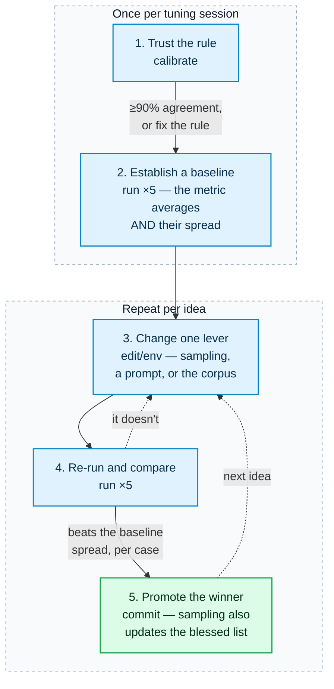

# Tuning the models

A practical guide to changing the model configuration, proving the change is a
real improvement, and shipping it. If you just want to understand the metrics,
read [`README.md`](README.md) first; if you want to *act* on them, you're in the
right place.

The method is one sentence: **change one thing, measure it against the run-to-run
noise, and keep only what clearly beats the noise.** Everything below is that
sentence with the commands filled in.

> For **contributors changing the shipped model config** in `config/`. It scores
> the engine against this repo's fixed golden corpus — not against your own
> system's text — and every scoring run calls live models. Embedding the engine
> instead? You want [docs/First-Run.md](../docs/First-Run.md).

## Before you start

- **Credentials for your configured vendors.** Producing a sweep calls live
  models, so you need whatever the tiers in `config/model_tiers.toml` select —
  Google Cloud application default credentials plus a project and location for
  Vertex, or an API key for Anthropic or OpenAI. See
  [Configuration](../docs/Configuration.md#provider-environment). Scoring
  itself is offline — the matcher is a rule and the standing of the unmatched
  comes from the vote ledger — and so are `verify_corpus.py`, `pytest` and
  `calibrate`.
- **Dependencies installed:** `uv sync`.
- **A clean corpus:** `python evals/verify_corpus.py` should be green.

## The money: what `run` asks before it spends

`run` is the one command here that spends. Before the first request, it
prints what the sweep is expected to cost and waits for you to accept it.

There is **no ceiling**. You may accept any amount — it is your money, and
the gate exists so you know what you are accepting, not to cap it.

Every amount carries one of three labels, and the label says how good the
number is:

| Label | What it means |
| --- | --- |
| `recorded` | A merged Baseline ran this exact configuration and cost this. A real number. |
| `estimated` | Another Baseline's token counts, repriced for your models. A best guess. |
| `unpriced` | No number exists — a tier's model is absent from the price map, or no merged Baseline exists to calibrate from. Never a zero. |

**Accepting means typing the amount back.** An enter or a `y` never proceeds,
because a habit should not be able to spend money for you. Where no amount can
be stated, type `unknown` — that is a real acceptance of a cost nobody can
state.

For a script, pass the number you accept:

```bash
python -m evals.harness.run run --mode analysis --out sweep.json --accept-cost 5.00
```

The run refuses if the estimate is higher than that; raise the flag and mean
it. `--accept-cost unknown` accepts an unstatable cost the same way.

**The run holds you to what you accepted.** Between cases — never inside one —
it compares the spend so far to your accepted amount. At a terminal it shows
the new number and asks you to accept it again; under `--accept-cost` nobody
is there to ask, so the sweep stops. A stopped sweep keeps every report it
already paid for, and its artifact records the cases it never ran, so it
reads as the partial record it is.

## The workflow at a glance



Do them in order. Steps 1–2 are setup you do once per tuning session; 3–5 are the
loop you repeat per idea.

## Step 1 — Trust the rule

**This step gates STRIDE's numbers and nothing else.** A **Framework Package**
whose claims carry a catalog identifier is matched by string, with no rule
composing an identity — ASVS is one, so its numbers are unaffected by anything
in this step.

STRIDE's recall and precision are measured by the identity rule
(`evals/harness/identity.py`): endpoint subset plus one action verb. If the
rule disagrees with the recorded labels, every number downstream of it is
noise. Check it first — offline, no credentials:

```sh
python -m evals.harness.run calibrate --out agreement.json
```

This must report **≥90% agreement**. If it doesn't, the fix is the rule or the
verb vocabulary (`evals/harness/verbs.py`), not a lower bar — a lenient rule
inflates recall silently, which is the expensive way to be wrong. Don't tune
anything until this passes. The shipped rule reports 92.5% over the 200 pairs
it can read, and the pairs it refuses are counted beside the bar.

What passing means is narrower than it looks. The labels are agent-authored and
a person has read 30 of the 339, so this measures whether the rule reproduces
them and not whether they are right. See the top of [README.md](README.md).

A rule change is a re-keying event, not a dependency bump: bump the fingerprint
version, run `rekey`, and the whole vote ledger recomputes under the new rule
with no re-vote. The retired LLM judge could not offer that, which is half of
why it is gone; the other half is that a human vote answers the question the
judge was guessing at.

## The fan-out is what a provider quota sees

**One job fires one `strong`-tier request per lane of every framework it names,
all together at the barrier.** That is
`analysis_service.frameworks.widest_fan_out()` — 23 today — and at roughly 14K
input per lane it is a **~322K token burst from a single job**.

Against a 200,000 tokens-per-minute quota that job cannot complete, and no
ceiling in `config/resilience.toml` helps: `max_active_jobs` bounds *jobs*, and
this is one job. The failure is a provider `RateLimitError` after the configured
`attempts` are spent, mid-sweep, with no artifact written.

Two levers, in order of preference:

1. **Raise the quota.** The only route that sweeps every framework at once.
2. **`--framework stride`** — narrow the selection. Six lanes is a ~72K burst
   and fits under 200K. It is a pure selection: it names no option and changes
   no reference set, so a narrowed sweep measures the same cases the same way
   and simply measures fewer frameworks per case. It prints the cases it skips.

Check the arithmetic against your own quota before a long sweep rather than
after it. A rate-limited run spends real money and produces nothing.

## Step 2 — Establish a baseline (and its spread)

You can't tell a real gain from luck without knowing how much the numbers move
when *nothing* changes. **This is not a formality.** Five `gpt-4o` extraction
runs on an unchanged config, 2026-08-23, gave failed-case counts of **2, 2, 5,
5, 10** — a five-fold spread from chance alone. Three findings reported off
single runs that week had to be withdrawn once that was known.

Run the full suite five times on the current config:

```sh
for i in 1 2 3 4 5; do
  python -m evals.harness.run run --mode analysis --out baseline-$i.json
done
```

Then measure how much the numbers move when nothing changed. The **spread** is
the point — it's your significance threshold for every later comparison — and
`stability` computes it from the artifacts, no credentials and no re-run:

```sh
python -m evals.harness.run stability baseline-*.json --out baseline-spread.json
```

Read two things off it. `worst_case_recall_spread` is the band any later
comparison has to clear. `sometimes_matched` — references found in some runs and
not others — is the same fact per reference, and it is the more useful one when
a case's recall happens to land on the same number twice by finding different
threats.

If a metric's spread across the five runs is wider than any change you'd hope to
see, that metric simply isn't sensitive enough to gate on — note it and rely on
the others.

### Which numbers matter

The run prints and records several metrics ([`README.md`](README.md) has the full
list). When tuning, watch these three:

| Metric | What a good change does | Trap |
| --- | --- | --- |
| **must-find recall** (per case) | goes up, or holds, on **every** case | An aggregate average hides one case collapsing. Always read per case. |
| **near/far exemplar delta** | shrinks or holds | A change can lift average recall while widening this gap — a worse model that looks better. The far-domain cases are the honest test. |
| **critic yield** (a pair) | kills more junk (`killed-rejected`) without killing real findings (`killed-real`) | A kill count alone tells you nothing — read both halves together. |

All of these are *relative to the rule and the ledger*. Use them to compare
configurations and track movement; never quote them as absolute scores or
against other tools.

### The half a person grades

Neither of the two halves above says whether a finding is *right* — both grade
the tool against records an agent wrote. The review loop is what adds a human
judgement, and it costs no credentials:

```sh
uv run python webapp/review.py --voter <your-name> \
  --artifact baseline-1.json --artifact baseline-2.json  # ...one per run
```

Name every run of the arm. The queue then asks first about the findings those
runs disagree on, which is where one answer settles the most.

[VOTING.md](VOTING.md) is the whole procedure — what each answer moves, and
what the four standings do to a number. When tuning, watch two of them, and read
them the way you read critic yield — as a pair:

| Metric | What a good change does | Trap |
| --- | --- | --- |
| **`rejected_rate`** (per case) | falls, or holds | A style down-vote is not this number. `poorly-written` leaves the finding in the pool, so a config that writes worse cannot flatter this one. |
| **`pooled`** against **`unvoted`** | `pooled` rises while `unvoted` falls | `rejected_rate` reads 0.0 over a cold ledger. A low number beside a large `unvoted` count means nobody has looked, not that the tool is right. |
| **`writing_aggregate.objection_rate`** | falls, or holds | Where a style objection lands, and the only number it moves. It is a rate over the findings people answered, so read `answered` beside it. |

The votes reach the numbers with no provider call: `score` re-reads the ledger
over a finished sweep's saved reports.

```sh
python -m evals.harness.run score baseline-1.json
```

A vote hangs on a finding's fingerprint, so tuning does not re-spend it: after
the first sitting, a configuration change puts only its *new* findings in the
queue. That is what makes this affordable per experiment rather than per
session.

### The mechanically matched half

ASVS's numbers rest on a catalog match rather than a composed identity.
Watch these, under `applicability` and `applicability_aggregate` in the
artifact:

| Metric | What a good change does | Trap |
| --- | --- | --- |
| **applicability recall and precision** | both go up, or one holds while the other rises | **Read them together or not at all.** An ASVS claim rules applicability and never a pass, so a lane that ruled *everything* applicable scores 100% recall. Recall alone is trivially winnable and worthless. Precision reads `n/a` until a case declares `reference_set: exhaustive`, because the complement of a sample is not a set of negatives — so today recall has no partner and no ASVS run is tunable on this row. |
| **`off_catalog`** | is zero, and stays zero | Not a tuning number. It counts claims naming a requirement the run's level does not carry — the package composing an identifier its own catalog cannot reach. Any value here is a bug to fix, not a lever to pull. |
| **applicability exemplar delta** | shrinks or holds | Same question as STRIDE's, over this package's own exemplars. `exemplar_proximity` sits on the `(case, framework)` pair, so a case near STRIDE's payments exemplar is near nothing of ASVS's. |
| **applicability yield** (a pair) | rejects more the corpus did not expect (`earned`) without rejecting what it did (`destroyed`) | The ASVS critic's only destructive move is `rejected` — the ruling that a requirement does not apply. `destroyed` is the veto number here, exactly as `matched_killed` is for STRIDE, and a rejection count alone reads as either. |

**What moves each cell, when recall is short:**

| Cell | Usual cause | Where to look |
| --- | --- | --- |
| `missed` | the lane agent did not raise a requirement the case expects | that chapter's `frameworks/asvs/lanes/<chapter>/skill.md` and its exemplars |
| `over_applied` | the agent ruled a requirement applicable the case did not expect | the chapter's `## Applicability` section — or the corpus, see below |
| `off_catalog` | the composed identifier is outside the run's level | a defect in the package, never in a prompt |

**And check the lead first.** `evals/harness/triggers.py` reports, per framework,
whether a deterministic rule fired in a claim's lane on an element it names.
ASVS sits at 32% against STRIDE's 80%, and eleven of its seventeen chapters draw
no lead on any reference claim at all
([#218](https://github.com/mstarks01/work-agent/issues/218)). A missed
requirement in one of those chapters is not a prompt problem — the agent was
never handed the lead. **This costs no provider call**, so read it before
spending a sweep.

## Step 3 — Change exactly one lever

Change one thing at a time — two at once and you can't tell which moved the
numbers. Your levers, roughly in order of leverage:

### Sampling (decoding parameters)

`config/sampling.toml` holds the per-tier decoding params. To *try* a value
without editing the file, use an environment override (see
[Configuration](../docs/Configuration.md#sampling-overrides)) — this is exactly
what a sweep does:

```sh
# Try a stated temperature on the strong-tier category agents for one run:
ANALYSIS_SAMPLING_STRONG_TEMPERATURE=0.4 \
  python -m evals.harness.run run --mode analysis --out warm-strong.json
```

The canonical sampling experiment is three arms on the same corpus, **decided
by the far-domain cases**:

1. **the model's own default** — the shipped state, which sets no temperature.
2. **`temperature = 0`** — greedy (`ANALYSIS_SAMPLING_*_TEMPERATURE=0`).
3. **k-of-n sampling** — draw several candidates and union them (higher recall,
   but several times the cost, so it has to clearly earn it).

Run each arm five times, compare each to the baseline band, and read the near/far
delta *per arm*: temperature 0 may be flatter on the near-domain cases while
costing recall on the far ones, which is the whole reason to test it.

**Arm 2 costs you models, and that is part of what it has to earn.** A tier that
states a temperature cannot run Claude 4.7 or later, which rejects the parameter,
and takes only `1` on an OpenAI reasoning family. Arm 1 runs anywhere. If arm 2
wins, `promote` will refuse it — the file leaves `temperature` unset with a
rationale, and pinning a param the file deliberately leaves unset is a human
decision that owes a replacement rationale, not a silent sweep write.

### Prompts and exemplars

The category-agent prompt and its worked examples (`prompts/analyze.md` and
`prompts/exemplars/`) are the strongest
lever on recall — and the *cause* of the near/far gap, since all the examples
come from one domain (payments). Editing an exemplar or adding one from a
different domain is the most direct way to move that gap. Measure it exactly like
a sampling change.

### What extraction actually does, and what a prompt edit reaches

Ten `gpt-4o` extraction runs and three `luna` ones over the 13-case corpus,
2026-08-23. Read this before writing a prompt rule, because two of the three
written that week did nothing.

**Models rename everything.** Both models find the same architecture and label
it differently: the corpus says `entity:shopper`, both write `entity:shoppers`;
the corpus says a flow is `settlement-webhook`, luna writes `payment-webhook`
and gpt-4o writes `post-webhook` for the same two endpoints. Roughly a third of
what reads as "missed one element, invented another" is one element under two
names, charged on both sides. #293 folds the flow label out of the score for
this reason and folds nothing else, because nothing else has a structural key.

**Models drop the elements that only ever act.** An element that initiates a
flow and never receives one is kept about 42% of the time, against 60% for
everything else — lower in every run of both sets. The telling part is that the
extraction writes `flow source 'process:store-server'`, the exact ID the corpus
uses, and never declares the store server. It is not a naming problem and not a
misunderstanding. A source describes an initiator by what it does — "every store
server asks the deploy controller once a minute" — so it reads as behaviour and
never reaches an inventory of structure. `initiator_recall` is the reading that
isolates it.

**Models follow a contradiction rather than resolving it.** `extract.md` said
"write `unknown` where the text is silent" a dozen times, then gave `assets` a
closed vocabulary that rejects `unknown` and said nothing about the exception.
gpt-4o wrote `unknown`, which fails the whole model. It was following the
instruction into the one place it does not apply. **Check a new rule against
every closed vocabulary before shipping it** —
`test_every_extraction_failure_mode_is_declared` is that check.

**A prompt edit may simply not land, and you cannot tell which kind you have
written.** Closing the `unknown` contradiction worked: that failure appeared
once in 13 case-runs before and never in 65 after. Two edits asking for more
complete inventories did not, at either step — neither where the model notices a
dangling endpoint nor where the omission happens. Both were explicit and gave
examples. Neither moved the number at all.

So budget for a null result. An edit that removes a contradiction is a different
kind of change from one that asks for more thoroughness, and only the first has
worked here.

**Reading is strong; judgement is weak.** Same models, same documents:
`store.encryption_at_rest` agrees 100%, `boundary.kind` around 90%,
`process.assets` **4-15%**. The split is whether the answer sits in the text or
needs a judgement call — and `extract.md` gives the asset vocabulary without
ever saying what a tag denotes. Expect any attribute that asks "what matters
here" to score like `assets` until something scopes it.

**Price does not buy extraction quality.** `gpt-4o` costs about five times
`gpt-5.6-luna` and scored the same on element recall, worse on attributes, and
produced 8 structurally invalid models where luna produced none. One task on one
corpus, so do not generalise it — but do not assume the pricier model extracts
better either.

**Models emit structurally broken references.** One luna lane agent produced
`flow:a-to-b:label:label`, its own label glued on twice. No instruction
anticipates that; the fail-closed join is what catches it.

### The corpus

The reference sets aren't meant to be exhaustive up front — they grow from real
output. Every run flags what it produced that the reference set does not carry,
one key per framework:

```sh
jq '.unlisted_for_promotion'      baseline-1.json   # STRIDE: grounded, plausible, unlisted
jq '.over_applied_for_promotion'  baseline-1.json   # ASVS: ruled applicable, not expected
```

The two are the same question, answered by different people's records.
STRIDE's lists the findings a reviewer voted into the pool — real, just not in
the reference set — so promotion consumes a human judgement already made.
ASVS's falls out of set arithmetic, and `off_catalog` has already taken out
the entry that is a package bug rather than a judgement.

Recurring ones are worth adding to a case's reference set (see
[`BLESSING.md`](BLESSING.md)). This makes the corpus a better yardstick over
time — but it also shifts every baseline, so re-run Step 2 after changing it.

## Step 4 — Re-run and compare

Re-run the suite five times with your change and compare to the baseline band:

- **Per-case must-find recall** — did any single case regress below its baseline
  spread? One case collapsing vetoes the change even if the average rises.
- **Stability** — run `stability` over the five new artifacts too. A change that
  lifts recall while widening the spread has bought an average with volatility,
  and the next sweep may not reproduce it.
- **Near/far delta** — did the gap widen? If so, you may have traded far-domain
  coverage for a better-looking average.
- **Critic yield** — did `killed-real` (real findings the critic threw out) go
  up? That's a regression hiding inside a higher kill rate.

A change that lifts or holds per-case recall, without widening the delta or
raising `killed-real`, is a keeper. Anything else is noise, or a trade you should
justify in the pull request.

## Step 5 — Promote the winner

**Prompt or corpus changes** ship like any code change: commit the edited files
with the run artifacts (or a summary) in the PR so a reviewer can see the gain.

**Sampling changes** need one extra step. Every report records the exact
configuration each node ran on as a **fingerprint** — a hash of the served model
build plus that tier's decoding parameters — and both the service and the eval
harness check those fingerprints against the ones this deployment has
**blessed**, in `config/blessed-fingerprints.toml`. Promoting a sampling winner
has to update *both* the config file and that blessed list, or the two disagree
and every run reads as uncertified. One command writes both, from the winning
artifact:

```sh
# Preview: shows every identity that would be certified, writes nothing.
python -m evals.harness.run promote candidate.json

# Apply, once the block above says what you expected.
python -m evals.harness.run promote candidate.json --yes
```

It needs no credentials. Everything it certifies was **observed during the
sweep** and written into the artifact's `provenance` block — which served build
answered for each tier, and the sampling that was resolved alongside it. You do
not supply the model strings, and there is no way to: promotion recomputes each
fingerprint from the recorded served build and sampling with the same function
the service certifies against, and refuses an artifact whose stored hashes don't
follow from the identities beside them.

The preview is the point of the two-step. It prints, per tier, the requested
route, the build that actually answered, every decoding parameter (with `unset`
shown as `unset`, never as a zero), and the full fingerprint that will be
blessed:

```text
STRONG
  requested: vertex_ai/gemini-2.5-pro
  served:    vertex_ai/gemini-2.5-pro-002
  nodes:     analyze_spoofing, analyze_tampering, critic

  temperature:         unset
  top_p:               unset
  max_output_tokens:   64000
  ...

  fingerprint:
    792c8e41...
```

Gemini is the example because one had to be. It is the one profiled family
whose served build differs from the requested route, which is what this preview
exists to show. On Claude, both lines hold the same string.

`--yes` rewrites `config/sampling.toml` in place (keeping its comments) and adds
the fingerprints to `config/blessed-fingerprints.toml`, keyed by tier. Commit
both. Blessing is additive — an existing blessed build stays blessed, and
promoting the same artifact twice adds nothing the second time.

**When a tier was answered by two builds.** A sweep is hours long and providers
rotate, so one tier can present two served builds in a single run. Promotion
refuses rather than picking:

```sh
python -m evals.harness.run promote candidate.json \
  --served strong=vertex_ai/gemini-2.5-pro-002 --yes
```

`--served` **selects among what was observed** — a build the sweep never saw is
rejected, so the flag can narrow what gets blessed and can never introduce it.
Run it again naming the other build if both should be certified; the manifest
accumulates.

Two refusals worth knowing about, both deliberate:

> `promote` refuses to pin a parameter the file deliberately leaves unset (like
> `top_p`). Those are unset because there's no measured value to pin — turning
> one on is a real decision that belongs in a reviewed edit with a reason, not a
> silent sweep write.

> It also refuses an artifact measured under a different `sampling.toml` schema
> version, or one carrying an `artifact_version` it doesn't know. Both are hard
> cutovers: re-run the sweep rather than re-pinning values across a schema
> change, which would bless a fingerprint describing parameters no run carried.

### Certification

Once promoted, a production run's fingerprints match the blessed list and the
run reports **certified**. Until then — and for any run driven by a temporary
`ANALYSIS_SAMPLING_*` override, since an override changes the fingerprint — the
run is **uncertified**, and its scores are surfaced as untrusted rather than
folded quietly into a baseline. To make an uncertified run fail outright (in CI,
say):

```sh
python -m evals.harness.run run --mode analysis --require-certified
```

It is off by default: the blessed list ships empty, so on by default it would
fail every run before anyone had a baseline to compare against, and people would
just switch it off.

A run reports **incomplete** if a tier its graph declares presented no
fingerprint at all. That is an assertion rather than a measurement — every tier
has a node that always runs — so it should never be seen; if it is, the sweep
did not exercise what it claims to have measured, and its scores are recorded
as untrusted whether or not `--require-certified` is set.

The service applies the same check to jobs it completes, using the same
`config/blessed-fingerprints.toml` — there, the equivalent switch is
`ANALYSIS_REQUIRE_CERTIFIED` and it withholds the report rather than failing the
job. See
[Architecture](../docs/Architecture.md#provenance-and-certification).

## What blocks a run, and what only informs it

Not every metric stops the world. The gating is deliberately staged:

| Signal | Blocks a run? | Why |
| --- | --- | --- |
| **Structural validity** (report parses, references resolve, severity matches the matrix, summary matches contents) | **Yes, always** | A malformed report is never a valid result. |
| **Certification** (every fingerprint blessed) | Only under `--require-certified` | Surfaced on every run, so a configuration that has drifted is never trusted silently. |
| **must-find recall, near/far delta, critic yield, coverage** | No — printed and recorded | These are findings to act on, not build breakers, until enough baselines exist to know what "normal" is. |
| **applicability recall, precision and `off_catalog`** | No — printed and recorded | Same reason, and they cost no provider call. |
| **Token usage and latency** | No — printed and recorded | Cost and wall-clock per node. What they inform is a budget decision, not a correctness one. |
| **Stability** | No — and it is not part of a run at all | It needs two finished sweeps, so it is its own command over their artifacts. |

The shipped file still states no temperature, so each tier decodes at its
model's own default. Tuning the per-tier values to something better is exactly
the loop above — run it once you have live credentials and the baselines to
measure against.

## Choosing a model to sweep with

A sweep costs money and a cheap model costs less of it. What a cheap model can
answer is a narrower question than it first appears, and the two sweeps recorded
below are what the distinction rests on.

**Use the tier you would ship for any number about quality.** Recall, precision,
groundedness, critic yield and anything derived from them are facts about the
model that produced them. They do not transfer down the capability range, and a
number taken on a cheap model describes a deployment nobody runs.

**A cheap model is the right instrument for a different class of question**:
does the harness work end to end, can this shape occur, does a gate hold, what
does a sweep cost. Every one of those is a question about machinery rather than
judgement, and the machinery is the same whoever is behind it.

### What two vendors showed

`claude-opus-4-6` on 2026-08-14 (12 cases) and `gpt-5.6-luna` on 2026-08-23 (13
cases), both `analysis` mode, STRIDE only. **The two differ by vendor,
capability, corpus size and eight days of prompt edits at once**, so read them as
two observations rather than a controlled comparison.

The mechanical layer did not move:

| | opus | luna |
| --- | ---: | ---: |
| mis-shape at `merge_drafts` | 0 | 0 |
| structural failures | 0 | 0 |
| unverified-quote rate | 2.0% | 3.4% |

Judgement moved a great deal:

| | opus | luna |
| --- | ---: | ---: |
| grounds per threat | 3.34 | 2.73 |
| **quoteless threats** | **13%** | **44%** |

**The branch mix is the capability tell.** Luna's 914 grounds were
`unknown-attribute` 408, `quote` 264, `derived-fact` 216, `absent-attribute` 26.
Naming an unknown attribute costs no reading; finding the submitter's own words
and quoting them does. A weak model takes the cheap branch, and `quoteless_rate`
is where that shows up first — before recall does, and without a reference set.
Watch it when you change tier.

**A weak critic destroys signal.** On luna the critic killed 12% of drafts,
caught 0% of the ones the reference set marks rejected, and destroyed 10% of
real findings. The critic seat is the last place to economise.

### The stress-test argument, and its limit

For a *can this fail* question a cheap model is a stronger instrument than a
capable one: if the model most likely to emit a malformed draft emits none, the
residual is not being hit. That is why the zero mis-shape rate above is worth
more from luna than it would be from opus.

**The argument weakens wherever the weak model avoids the risky path.** Luna
quoted on 56% of its threats against opus's 87%, so it exercised the quote
ladder less per threat, and its 3.4% rests on 9 failures out of 264. A zero from
a model that never took the branch is not evidence about the branch.

### Two things that are not model comparisons

- **The fired half of coverage is deterministic.** `116/143 rule evaluations
  fired` against a previous `104/144` is a fact about the corpus and the rules,
  not about the model. Only the *cited* half moves with the model.
- **`extraction` mode grades a different tier.** `analysis` seeds the blessed
  model at `prepare`, so a poor extraction does not reach the lane agents. Luna
  extracted badly — 63% attribute agreement, 0.19-0.50 recall — and the analysis
  numbers above are unaffected by it.

### Cheap per token is not cheap per answer

Luna billed reasoning tokens at 39% of completion on the analysis sweep and 33%
on extraction, and its mean lane latency was 21-43 seconds — no faster than a
frontier model. The saving is real and the wall-clock is not, so a cheap tier
buys budget rather than time.
